# Lecture 10 - Kernel method

[Slides](https://karthik-sridharan.github.io/3780fa26/Kernel.html)

## Review: linear methods

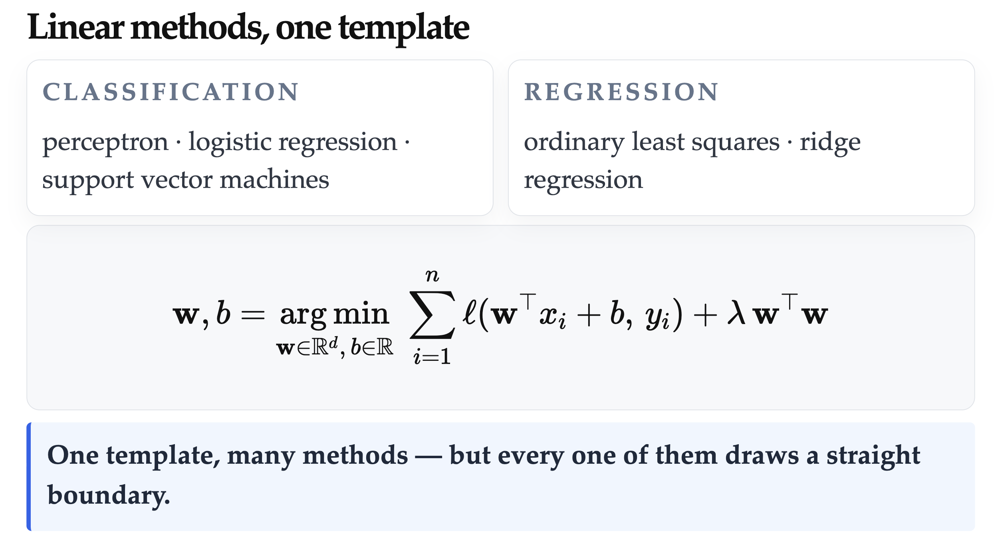

All these linear methods can be written in a ERM form:

### ERM forms of linear methods

- Perceptron: $w^*, b^* = \arg\min_{w, b} \sum_{i=1}^n \max\big(0, \, -y_i(w^\top x_i + b)\big)$
- Plain Logistic Regression: $w^*, b^* = \arg\min_{w, b} \sum_{i=1}^n \ln\left(1 + e^{-y_i(w^\top x_i + b)}\right)$
- L2-regularized Logistic Regression: $w^*, b^* = \arg\min_{w, b} \sum_{i=1}^n \ln\left(1 + e^{-y_i(w^\top x_i + b)}\right) + \lambda \|w\|_2^2$
- Soft-margin SVM: $w^*, b^* = \arg\min_{w, b} \sum_{i=1}^n \max\big(0, \, 1 - y_i(w^\top x_i + b)\big) + \lambda \|w\|_2^2$
- Ordinary Least Squares (OLS): $w^*, b^* = \arg\min_{w, b} \sum_{i=1}^n \big((w^\top x_i + b) - y_i\big)^2$
- Ridge Regression: $w^*, b^* = \arg\min_{w, b} \sum_{i=1}^n \big((w^\top x_i + b) - y_i\big)^2 + \lambda \|w\|_2^2$

> Notice that "Logistic Regression" is actually a classification algorithm.\
> SVM can also be written as: $\arg\min_{w,b} \frac12\|w\|_2^2 + C\sum_i^n \max(0,1-y_i f(x_i))$

### But...

But there are limitations of linear methods, for example, it cannot divide circles:

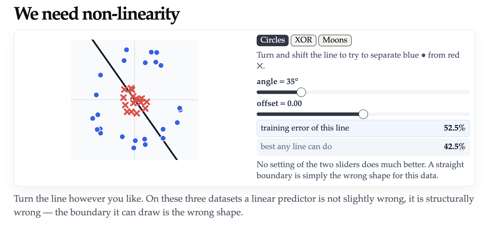

## Kernel method

Kernel methods make it possible to **solve non-linear problems** with the **algorithms for linear problems**.

## Magic 1: Lift to feature space

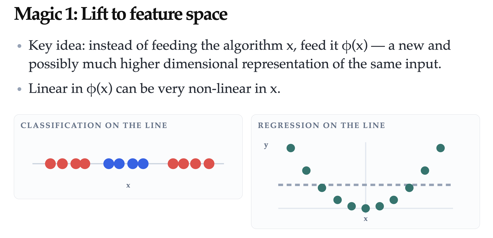

### Quiz 1

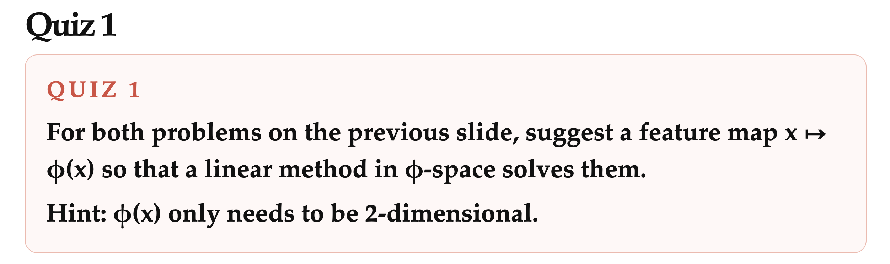
->Answer, you can add $x^2$ to $\phi(x)$

Original: $\phi(x) = [x]$, it cannot classify or fit regression correctly:
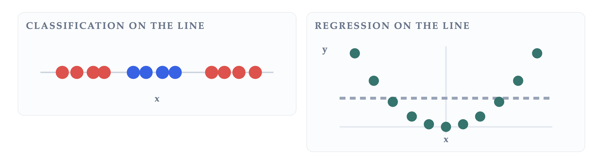

After lifting feature space: $\phi(x) = [x, x^2]^T$:
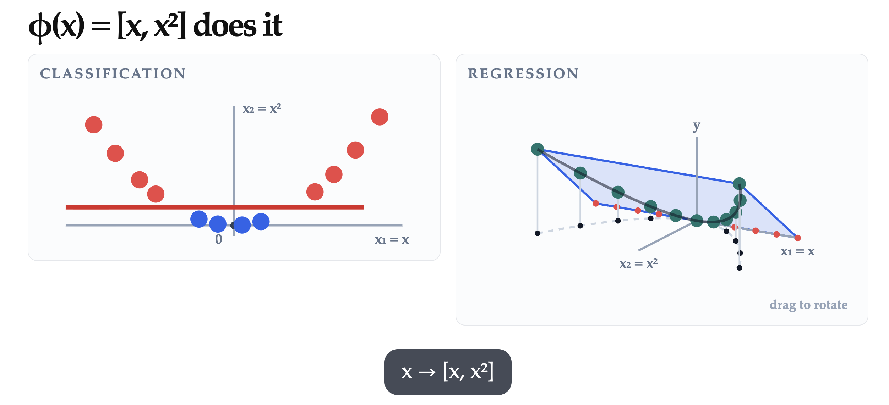
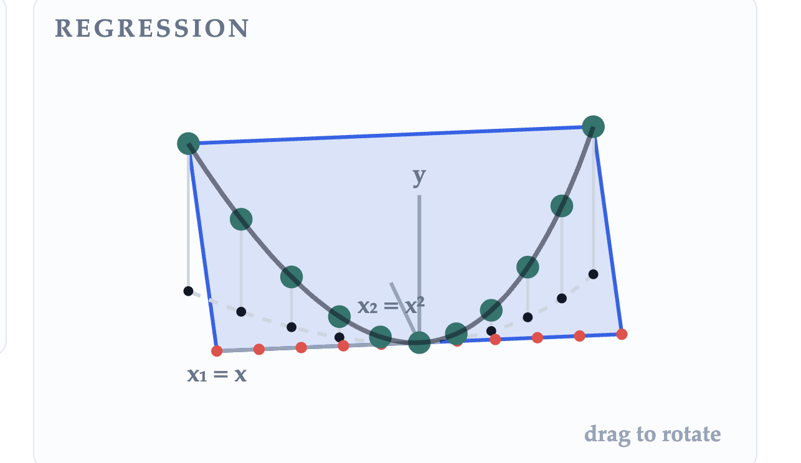

### Why lifting feature space works

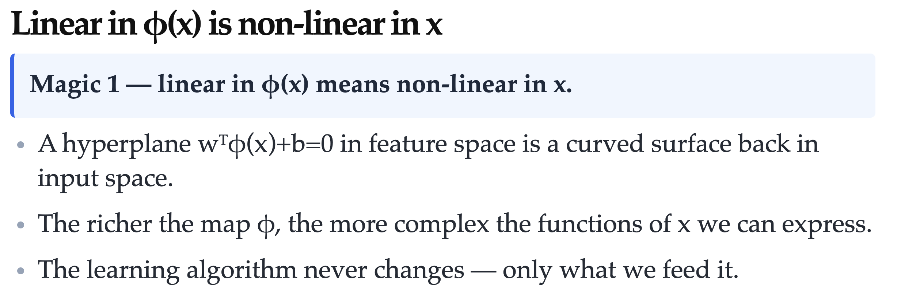

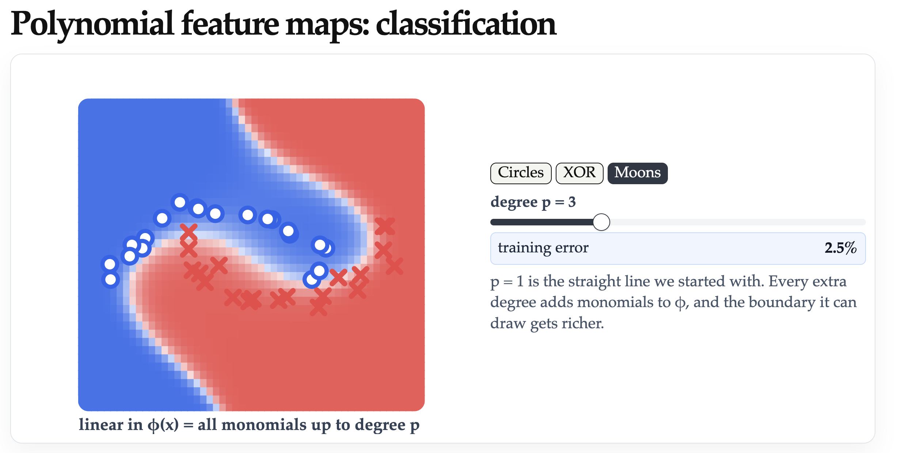
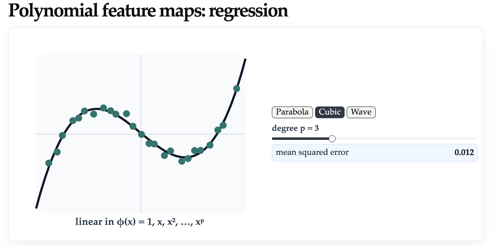

### Quiz 2

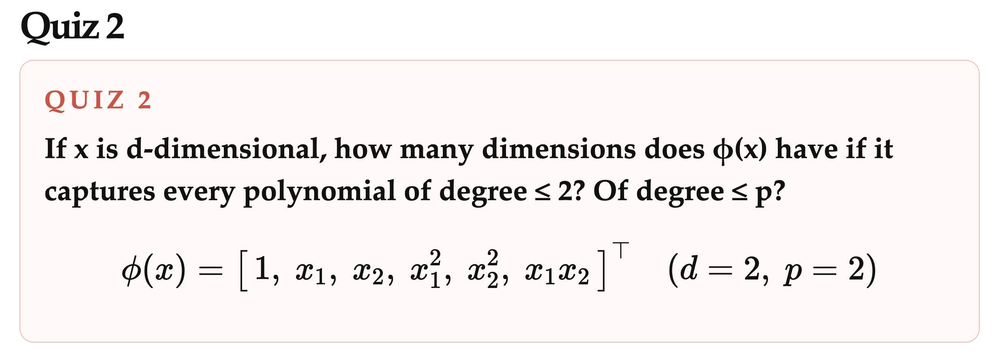
-> Place p boards among (d+p) positions: $\binom{d+p}{p} = O(d^p)$

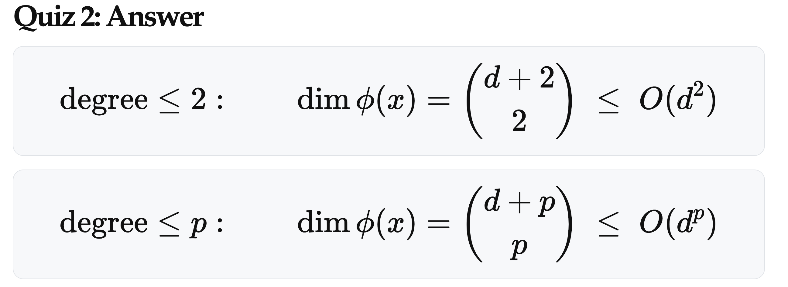

### Summary magic 1

Pro: Moving from the input x to feature vectors $\phi(x)$ lets us **model non-linearity**.\
Con: Enumerating $\phi(x)$ can get computationally **expensive** very fast. -> How to avoid it? -> Use [**kernel function**](#magic-2-we-never-actually-enumerate).

## Magic 2: We never actually enumerate $\phi(x)$

By using kernel functions, we can avoid enumerating $\phi(x)$:
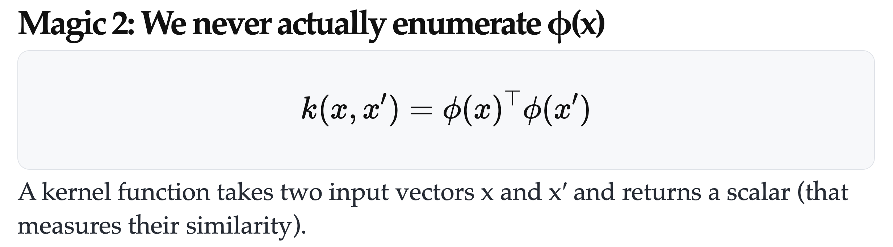

### Why kernel methods

With the help of kernel methods, we can write w as a linear combination of $\phi(x_i)$ (but we don't want to enumerate $\phi(x_i)$), and more importantly, **hypothesis can be written as a linear combination of kernel functions**:
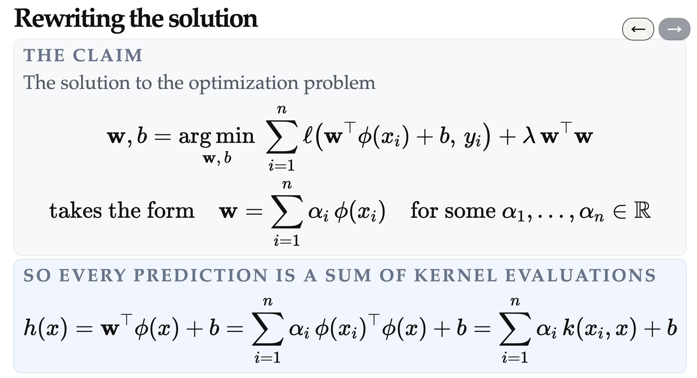

We will solve these questions in the following part:

- Part 1: why w is a linear combination of $\phi(x_i)$
- Part 2:
  - How to find coefficients of this linear combination
  - Why hypothesis can be written as a linear combination of kernel functions (and have same coefficients as w)
- Part 3: what makes a kernel function valid

### Step 1: Why can we write $w = \sum_i \alpha_i \phi(x_i)$?

Because in gradient descent, as long as the w in previous stage is a combination of kernel function, then every step/updata is a also linear combination of $\phi(x_i)$ (proved in the following image). Combining this with initial value of w (zero vector). So, in the end, the w we get is also a linear combination of $\phi(x_i)$ ([full proof](https://karthik-sridharan.github.io/3780fa26/Kernel.html#17)).
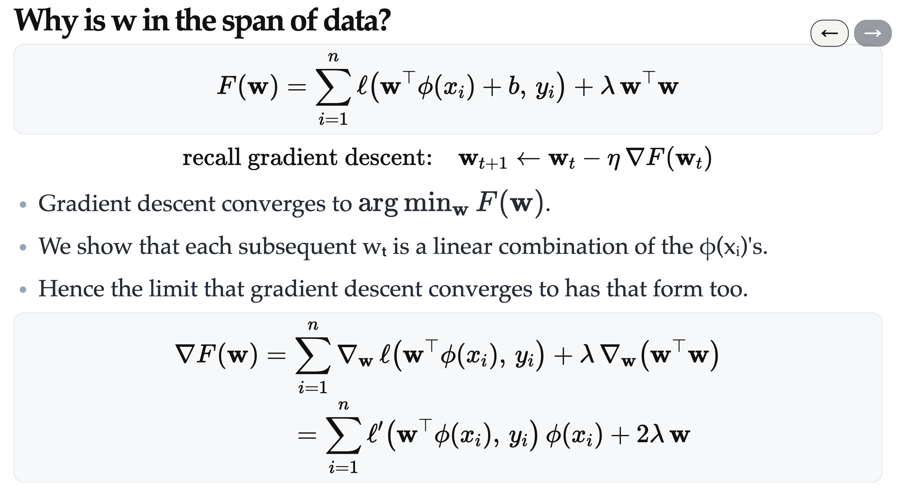

### Step 2: How do we find $\alpha_i$?

If we use the formula in the proof above to get $\alpha_i$, it would be very complicated, **instead, we can use the linear algorithms (that we learnt before) to get $\alpha_i$**

Read [this webpage](https://karthik-sridharan.github.io/3780fa26/Kernel.html#18)

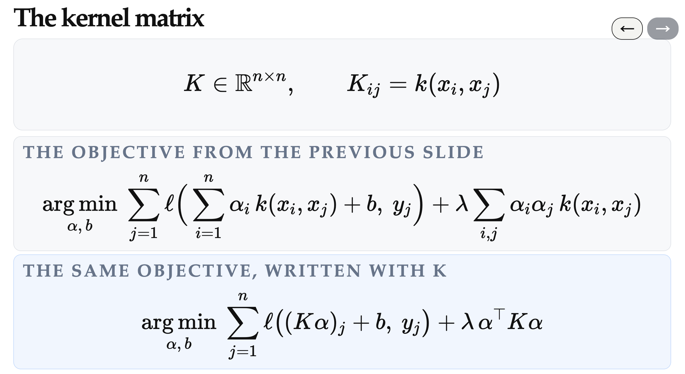
Now, our goal changes from finding w and b to:

1. Choose a kernel function $k(x_i, x_j)$
2. Finding $\alpha = (\alpha_1, …, \alpha_n)^T$ and b

### Quiz 3

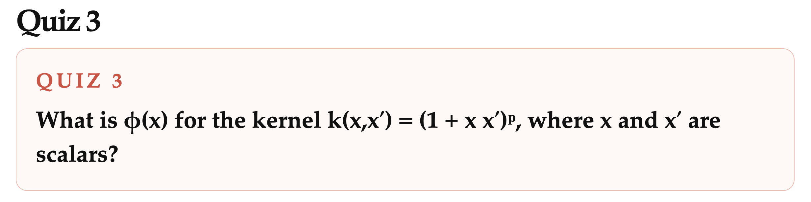

[Answer](https://karthik-sridharan.github.io/3780fa26/Kernel.html#21)

-> Assume $\phi(x) = [\phi_1(x) \dots \phi_d(x)]^T$

- $k(x, x') = (1 + xx')^p = \sum_{i=0}^p \binom{p}{i} (xx')^i = \sum_{i=0}^p \binom{p}{i} x^p{x'}^p$
- $k(x, x') = \phi(x)^T\phi(x') = \sum_{j=1}^d \phi_j(x)\phi_j(x') = \sum_{i=0}^{d-1} \phi_{i+1}(x)\phi_{i+1}(x')$

Combining these two, we know:

- d = p+1
- $\phi_{i+1}(x) = \sqrt{\binom{p}{i}} x^{i}$

So, $\phi(x) = \sum_{i = 1}^{p+1} e_i * \sqrt{\binom{p}{i-1}} x^{i-1}$ or $\phi(x) = \sum_{i = 0}^{p} e_i * \sqrt{\binom{p}{i}} x^i$

$\phi(x) = [1, \sqrt{p} x, \dots, \sqrt{\binom{p}{p}} x^p]^T$

### What does kernel mean

For example, here are some valid and useful kernels, including linear, polynomial, and radial basis function (RBF):
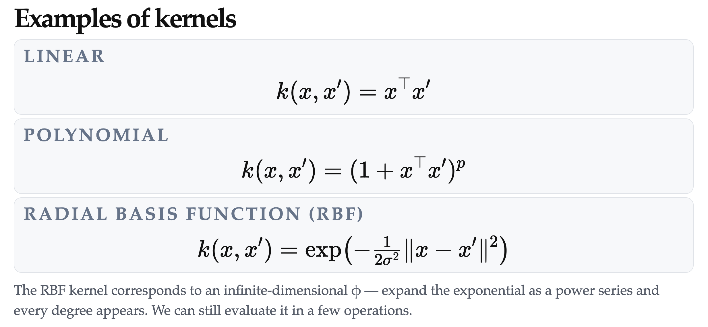
> The RBF kernel corresponds to an infinite-dimensional $\phi$. And it is like a smart version of KNN.

#### A kernel is a similarity

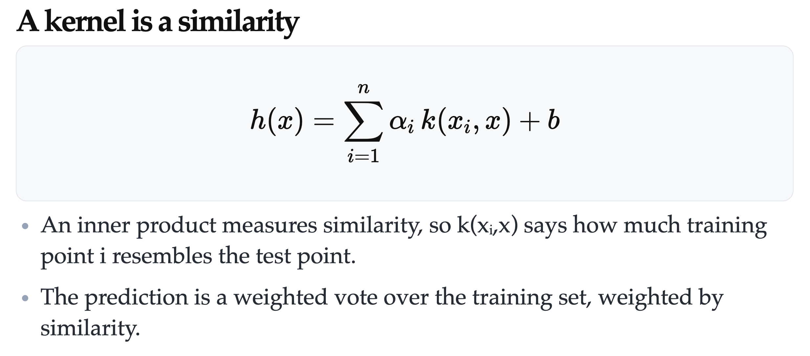
*An inner product measures similarity* -> because inner product is determined by the angle between 2 vectors.

#### RBF is somewhat like K-NN

When $\sigma$ is small, only nearest point (let's call it "j") have significant weight (meaning $k(x_j, x)$ is large), it is more like 1-NN. When $\sigma$ is greater, it becomes K-NN.
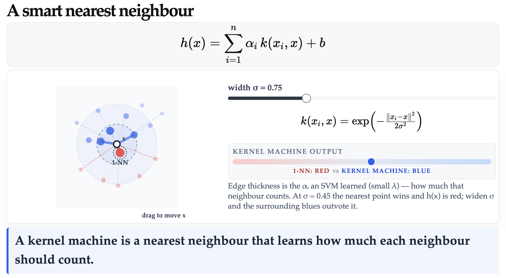

It is "smart" because it doesn't only look K nearest points, it take all points into consideration, but the nearest points has greatest weights.

Play ground: [rbf](https://karthik-sridharan.github.io/3780fa26/Kernel.html#24) and [others](https://karthik-sridharan.github.io/3780fa26/Kernel.html#25)

### Step 3: What makes a function k(x,x′) a valid kernel — a dot product in some feature space?

## What makes a valid kernel

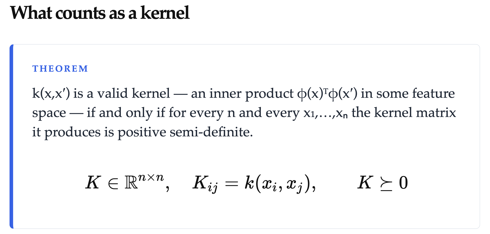
Valid kernel: the kernel matrix it produces is positive semi-definite for every n and every $x_1, \dots ,x_n$.

> Kernel or kernel function: $k(x, x')$\
> Kernel matrix: $K$, where $K_{ij} = k(x_i, x_j)$

## How to make new kernels

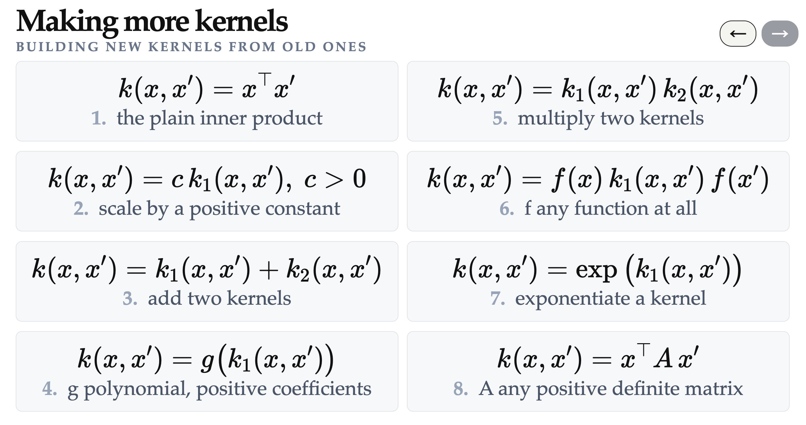

### Quiz 4

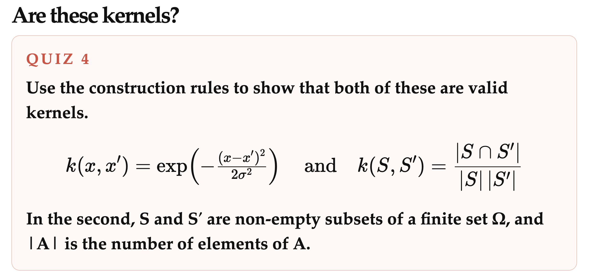

[Answer 1](https://karthik-sridharan.github.io/3780fa26/Kernel.html#29) and [answer 2](https://karthik-sridharan.github.io/3780fa26/Kernel.html#30)
