# Lecture 11 - Model Selection

Hyper-parameters, validation, and how far a validation score can be trusted. [Slides](https://karthik-sridharan.github.io/3780fa26/Model_selection#1).

## Training lifecycle

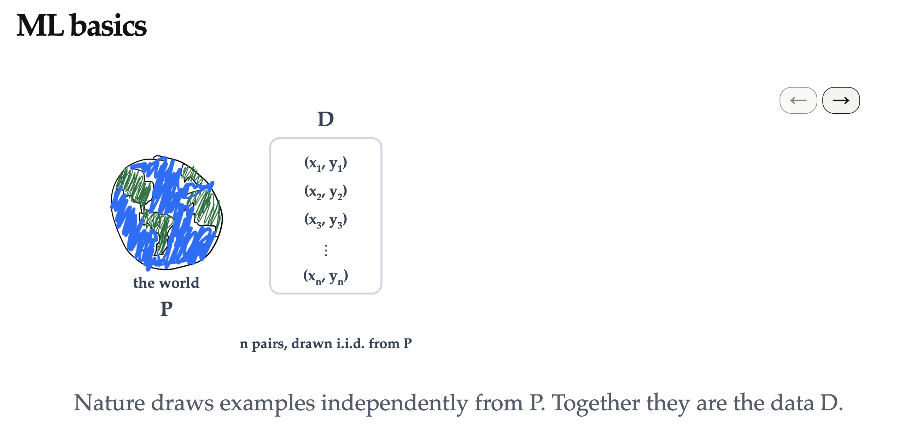
> i.i.d. independent and identically distributed

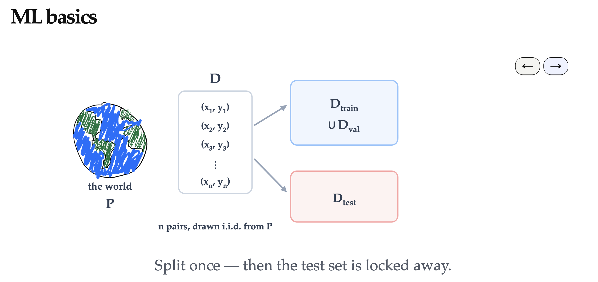
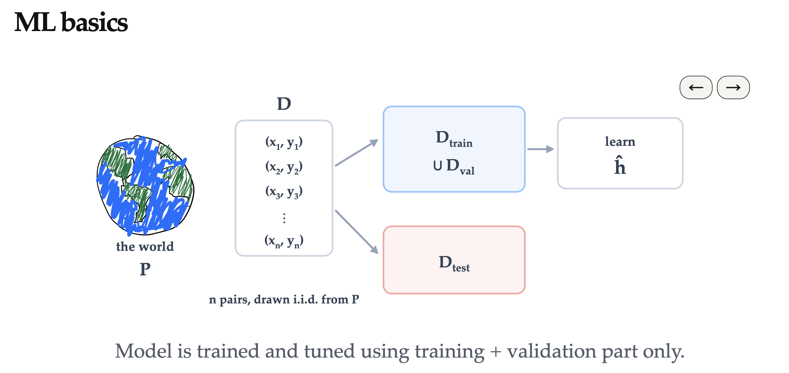
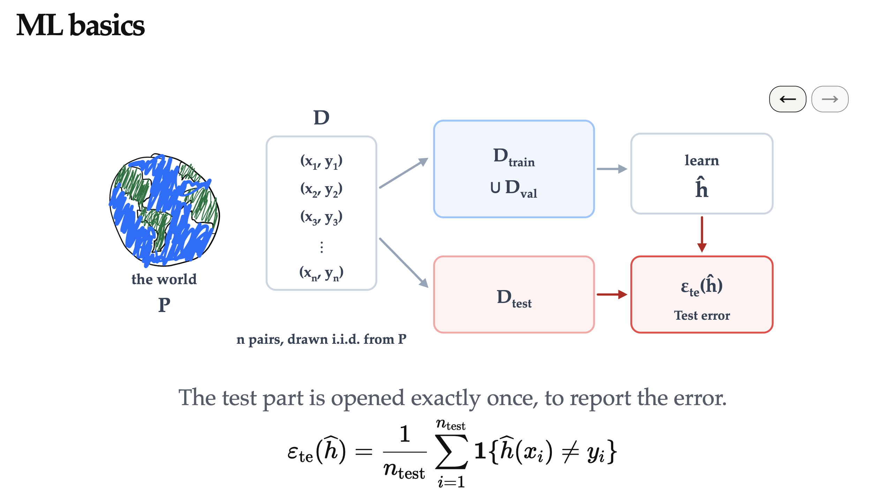

We should set test set aside (it should never be seen by model) because we want to make sure test error is a good estimation of deployment error. -> **Test is only used once, to report error.** (The error of your model is represented by **test error**).

## Expected/deployment error

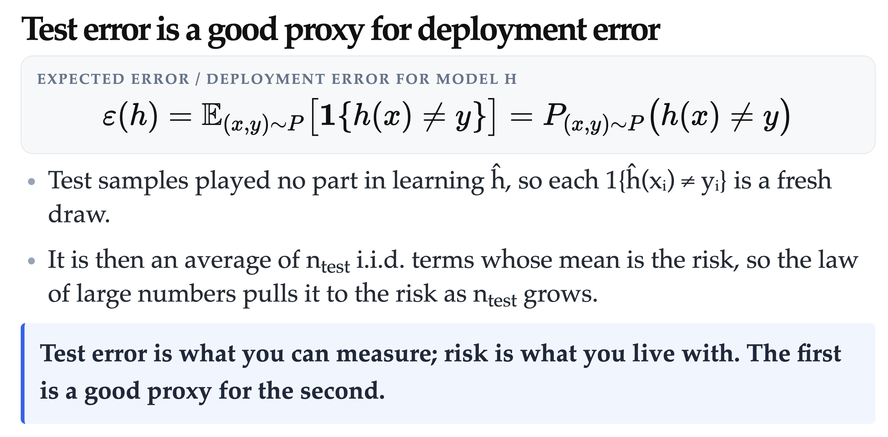
We can use test error to represent real error, but why?

Please notice that on the slide, the error is represented as average misclassification rate, but in more general case, it is **empirical loss on the training set (without regularization)**:

- $\epsilon(h)$: exception of error = $\epsilon(h) = E[\ell(h(x), y)]$.
- $\epsilon_{te}(h)$: test error = $\epsilon_{te}(h) = \frac{1}{n_{test}} \sum_{i=0}^{n_{test}} \ell(h(x_i), y_i)$

Notice: **error doesn't include regularization.**

### Hoeffding Bound

[Hoeffding bound](https://karthik-sridharan.github.io/3780fa26/Model_selection#4) tells us how good test error can estimate deployment error:
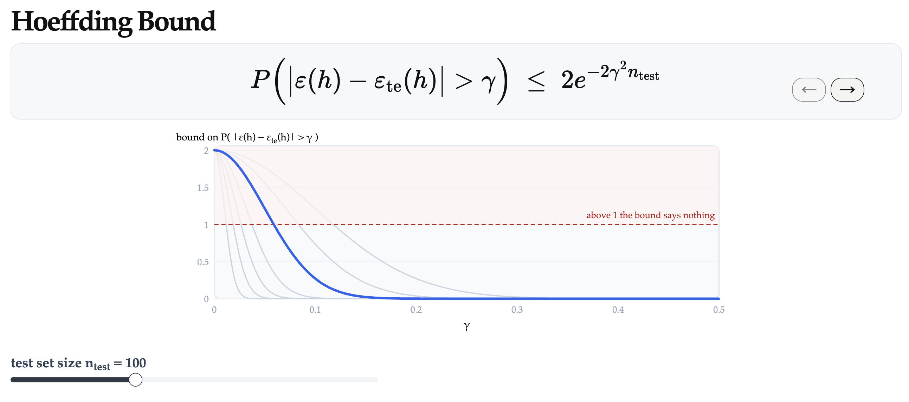

If your test set is large enough: n_test is large, then there is a very small chance that $​|\epsilon(h)−\epsilon_{te}(h) > \gamma|$.

### Failure probability

Let's assume $1 - \delta$ is the probability that test error is a good estimation of expected error, then $\delta$ is the probability that it is a bad estimation. We can call this $\delta$ as "failure probability".

When $n_{test}$ is small: the deviation (crossing point of line $y = 2e^{2γ^2n_{test}}$ and line $y = \delta$) is large
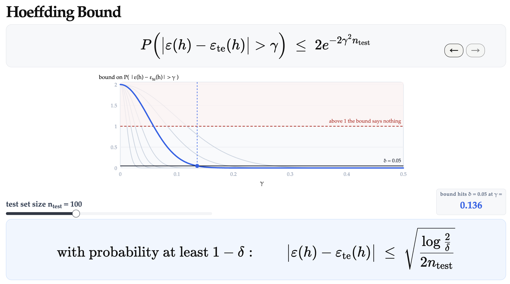
When $n_{test}$ is large: the deviation (or "slack") is small.
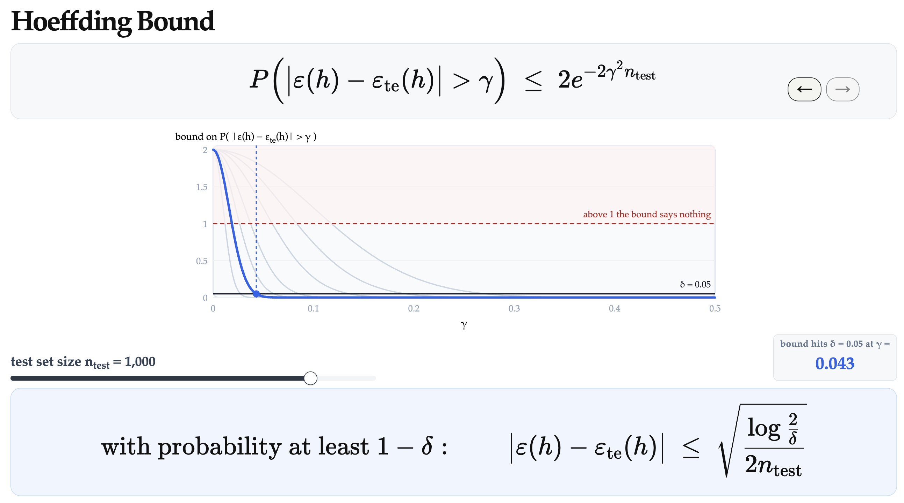

## How to choose hyperparameters

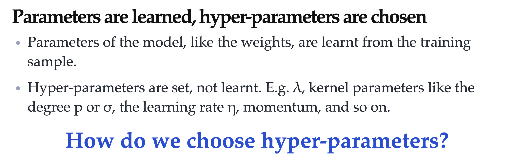

### Quiz

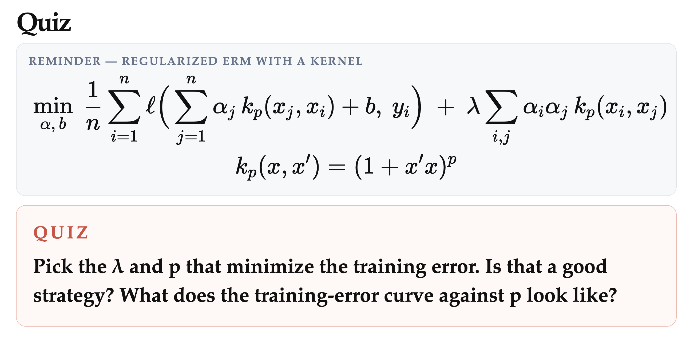

1. This is a bad idea, it is only trained on training set and you are choosing hyperparameter based on training error, you will always choose a super complex overfitted model (training error is close to 0) with $\lambda = 0$ (no penalty to model complexity).
2. When we increase p, we have more and more features, then we can make training error 0. But under such cases, the model is usually overfitted:
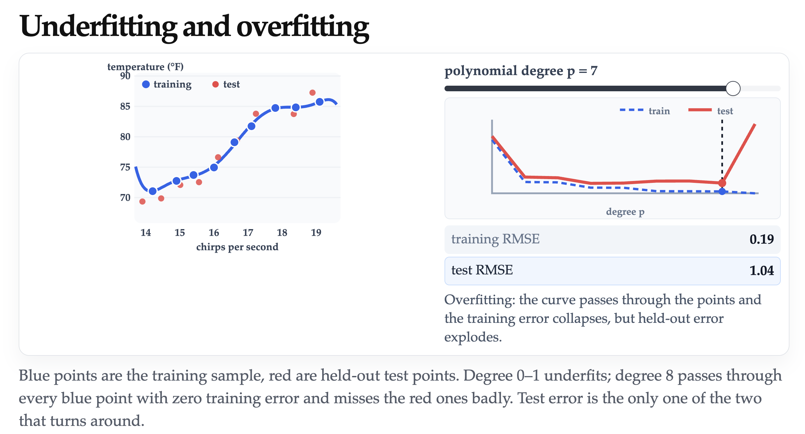

### Correct way to choose hyperparameters

This is how you should do to decide hyperparameters:
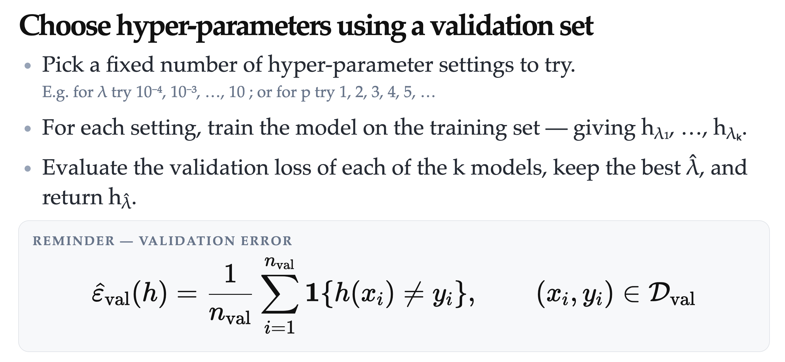

### Why it works

Why we can use validation error to choose hyperparameter (why we think validation error is a good estimation of expected error) -> Because of Hoeffding bound:
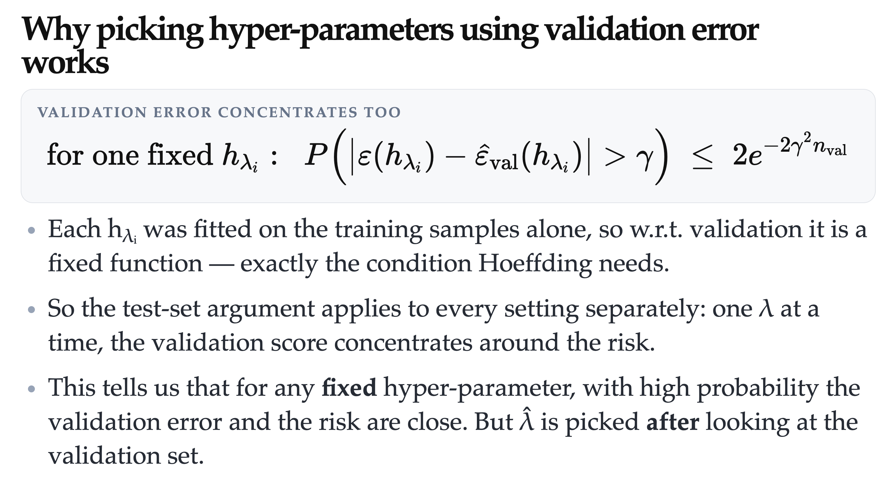

Prove it -> **union bound** (i.e. $P(A \cup B) <= P(A) + P(B)$):
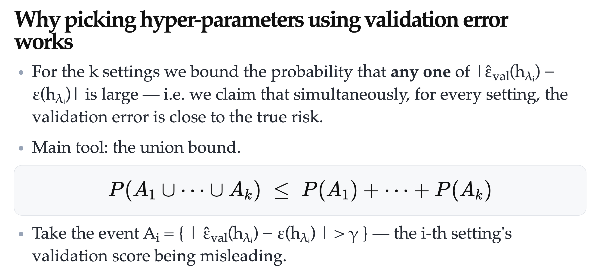
Here, $P(A_i)$ means the probability that the validation error of hyperparameter set i is far from expected error (i.e. the probability of $|\epsilon(h_{\lambda_i}) - \hat{\epsilon}_{val}(h_{\lambda_i})| > \gamma$)\
So, $P(A_1 \cup A_2 \dots \cup A_k)$ means: the probability that **any** one of validation error is far from expected error.

#### Step 1: rewrite union bound

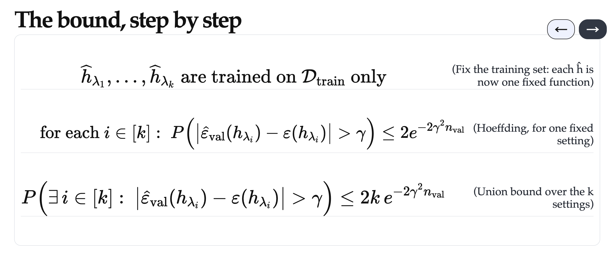
> Here hat ($\hat{\ }$) means “estimated from observed data.”

#### Step 2: use $\delta$ to represent the upper bound of probability

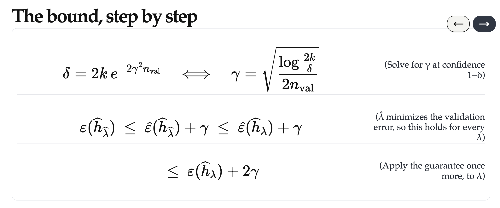
Remember: $\delta$ is the [failure probability](#failure-probability), and $1 - \delta$ is the lower bound of probability that all validation errors are good estimations.

> log is ln

i.e. P(all validation errors are good estimations) $\ge 1 - \delta$, or P(not all validation errors are good estimation) $\le \delta = 2ke^{-2\gamma^2n_{val}}$

#### Step 3: after some magic steps

$\widehat{\lambda}$ is the $\lambda$ that minimizes the validation error, which is also the set of hyperparameters we will choose.
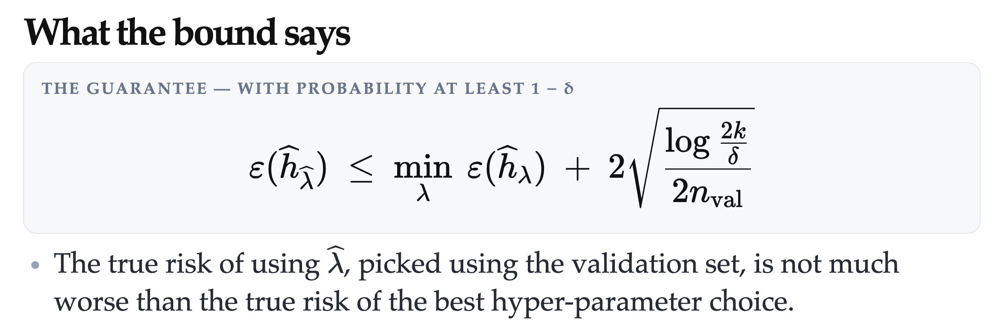

A important conclusion of it is: **there is almost no cost of adding more sets of hyperparameters**

For example, if you choose a $\delta = 0.05$. And you add hyperparameters sets from 10 to 100,000, then the slack you gain is only $\frac{\sqrt{\ln(2 * 100,000 / 0.05)}}{\sqrt{\ln(2 * 10 / 0.05)}} = 1.59$, so the slack only gains 59%, but you can test 10000x more hyperparameters!

## You cannot use validation set as test set

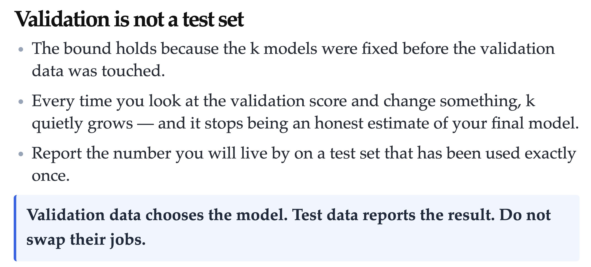

## Cross validation

When we don't have enough data, cross validation is very useful:
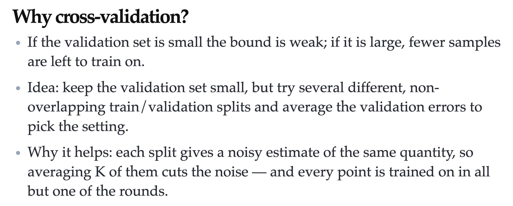

It can also be use to get *a more stable estimate of model or hyperparameter performance*

So, how to do a cross-validation? -> Read next section:

### K-fold cross-validation

If I have m sets of hyperparameters ($h_1, \dots, h_m$), then I train k models for each set. And we get k\*m models with k\*m validation errors. We compare the **average validation error** of each set, choose a hyperparameter set with highest average validation error.

> [!important]
> For each set, we need to train k models (k sets of w and b), and calculate k validation errors, then average them.\
> For each set, we have a averaged validation error, we choose the set of lowest validation error\
> Then, to get the w and b, we do **NOT** average w and b from k-fold validation.\
> But instead, we **retrain a new model from scratch using the selected hyperparameters on the full training + validation data**.

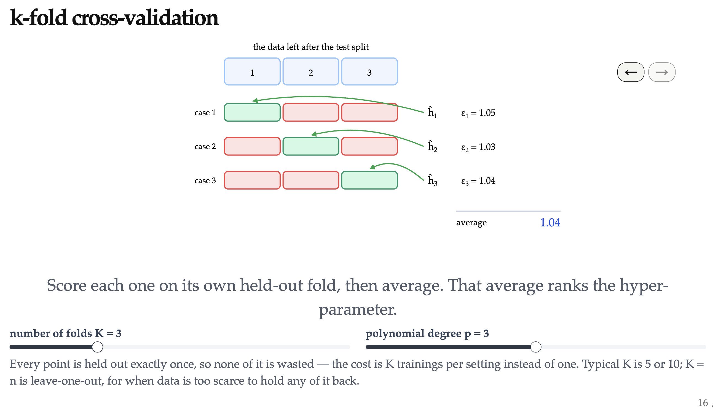

## Search hyperparameter

- Random search: randomly choose hyperparameters in the hyperparameter space
- Grid search: choose hyperparameters with fixed steps.

Counterintuitively, a research shows that random search is always better than grid search: [demo](https://karthik-sridharan.github.io/3780fa26/Model_selection#16):
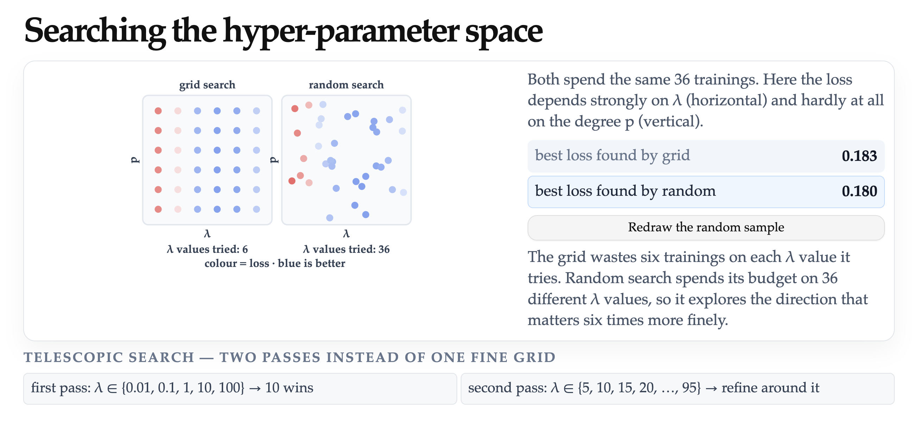

Because in real-world machine learning, only a small subset of hyperparameters are important.

## Early stopping

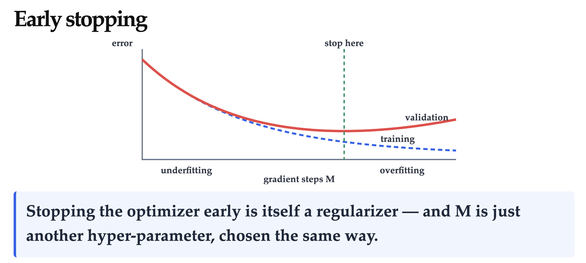
When you stop in the middle of this graph, it is called early stopping. Early stopping can also be regarded as a regularizer (regularizer is used to prevent overfitting).

## Summary

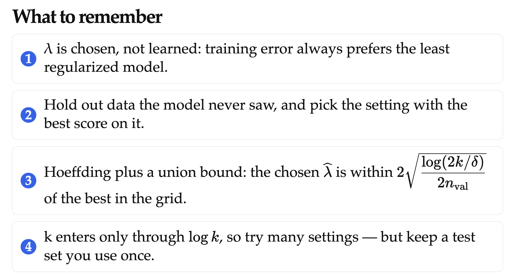
