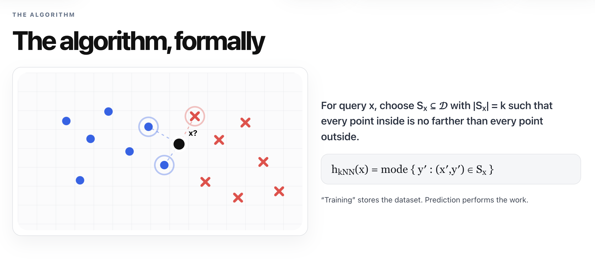
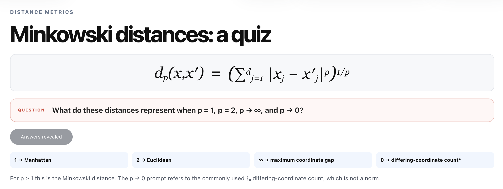
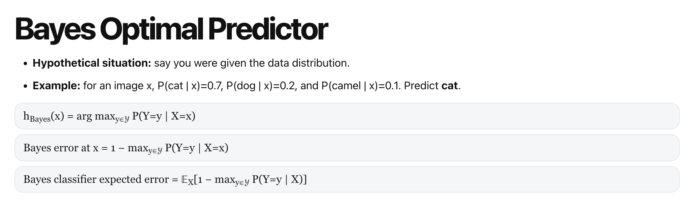
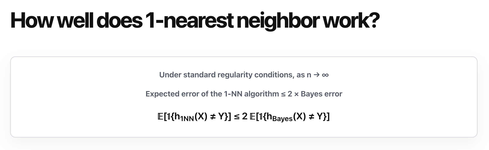
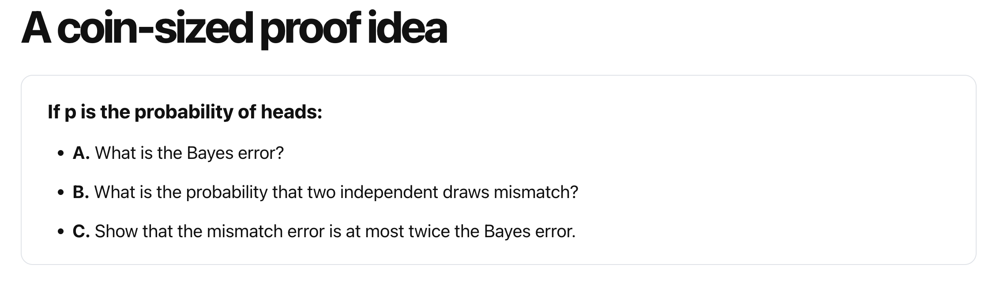

# Lecture 2 - KNN

K-NN is supervised learning (with label).
[Slides](https://karthik-sridharan.github.io/3780fa26/Knn#1)

## What an example look like

Read slides, e.g. MNIST dataset. There are inputs and labels.

Let's convert raw data into input (feature) vector (x ∈ R^d). Called **Feature extraction**

All labels consist of a label space.

A training dataset looks like: D = {(x1, y1), ... (xn, yn)}

### Classifier

h: X -> Y

Classification error: l_0-1 (h(x), y) = 1 {h(x) != y} (loss function)

**Goal: minimize loss function.**

> Regression won't be covered today.

[summary](https://karthik-sridharan.github.io/3780fa26/Knn#6)

## KNN

It is based on the assumption that similar inputs should have similar labels. (but [it may fail](https://karthik-sridharan.github.io/3780fa26/Knn#12))

Concept: If we want to classify a random input x, we do the following step to x: *Ask the k closest labeled examples. Return their most common label.*

Q: how to measure distance? -> covered in future

> [!important]
> Try it by yourself [KNN](https://karthik-sridharan.github.io/3780fa26/Knn#9) and 

Cons: every time, you need to calculate its distance to every labeled data.

Mode means the most frequent label.

When it comes to a tie: read [this part](https://karthik-sridharan.github.io/3780fa26/Knn#18).

### Minkowski distances

Q: What do these distances represent when p = 1, p = 2, p → ∞, and p → 0?

- p == 0 -> just gives the number of dimensions that xj != x'j
- p == 1 -> L1 regularization (Manhattan distance)
- p == 2 -> L2 regularization (Euclidean distance)
- p == 3 -> shows the dimension where xj and x'j have greatest difference

### Normalization / standardization

We need normalization to avoid some dimension is more weighted than the result.

Q: What happens when k = n, the size of the dataset? -> It just returns which group occurs most in dataset. It will classify all inputs into same group.

So, when n grows, let k grow mildly, but keep k/n -> 0.

### Bayes optimizer predictor

It is the ***gold standard*** in ML.

There is an paper says 1-NN (KNN when k = 1) works well:

Answer:

- 1-p
- 2p(1-p)
- prove 2p(1-p) <= 2p Becaue p <= 1

#### Why Bayes matters

#### Why 1-NN works

Read [slides](https://karthik-sridharan.github.io/3780fa26/Knn#24)
