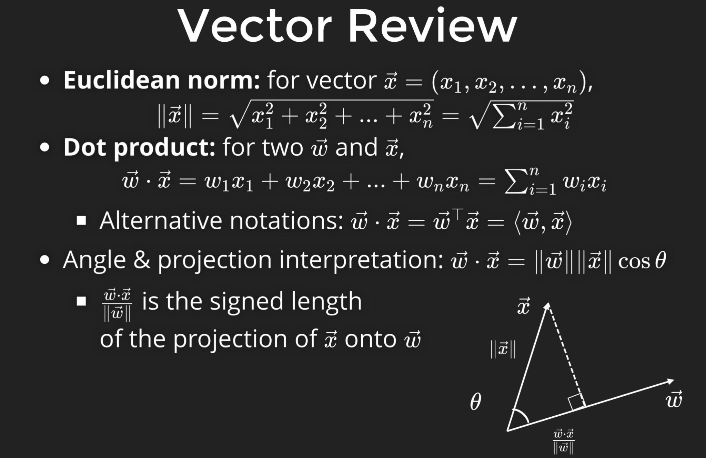
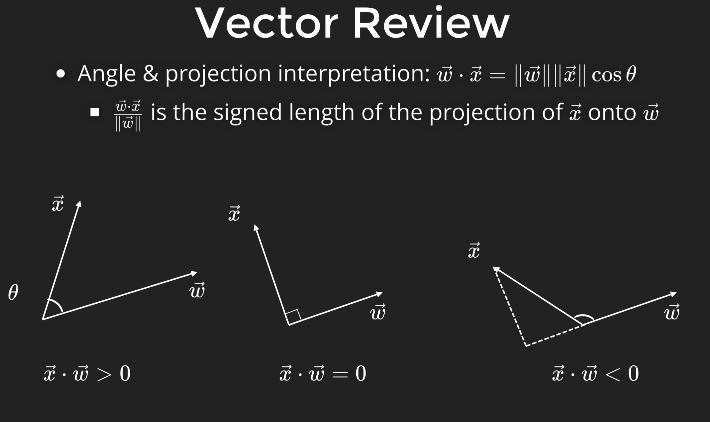
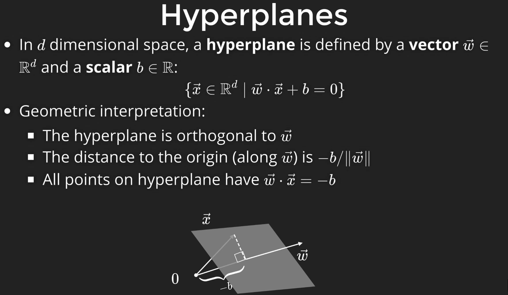
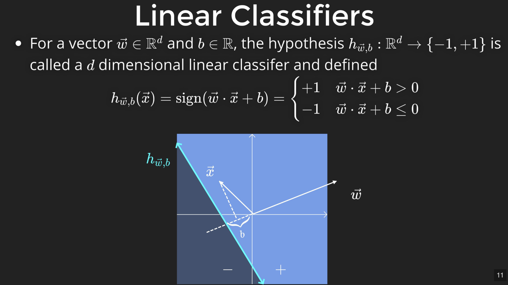
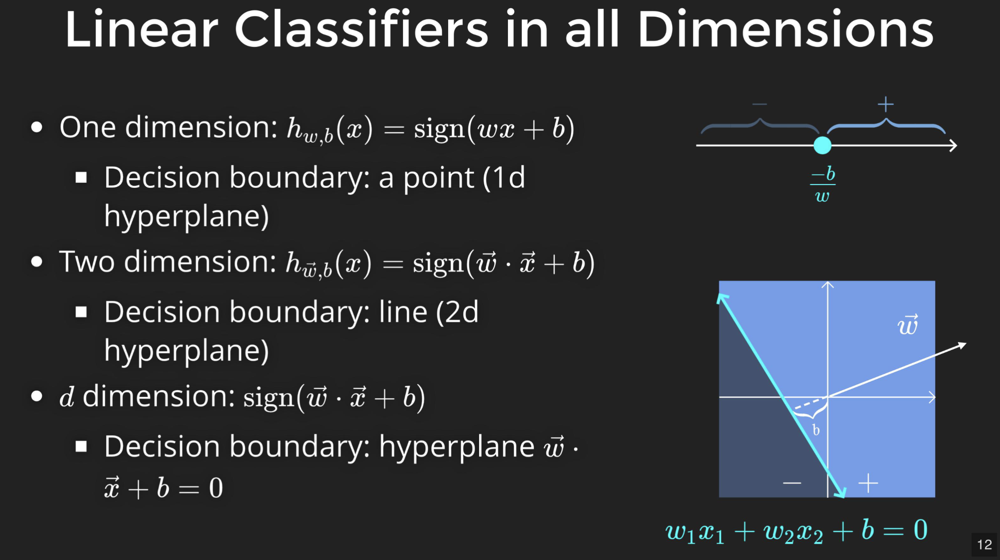
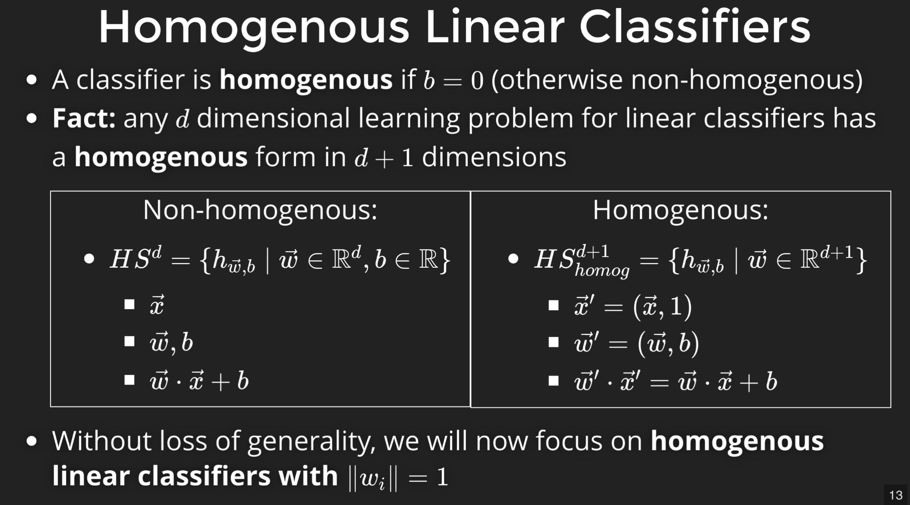
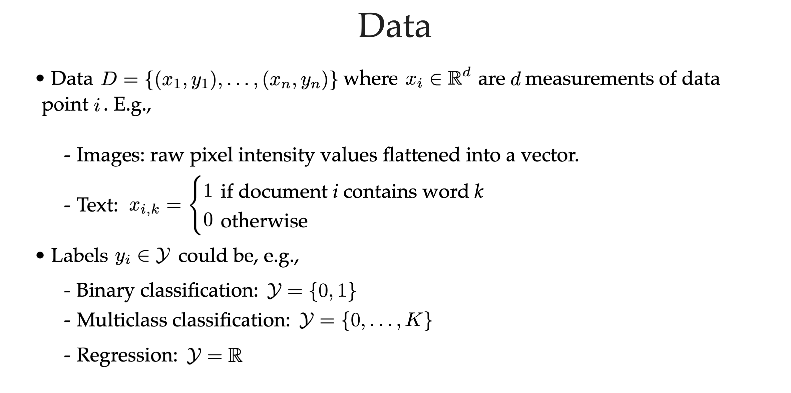
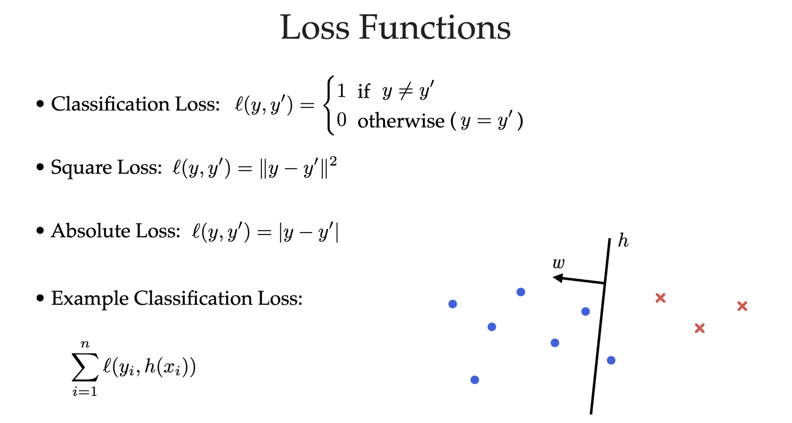
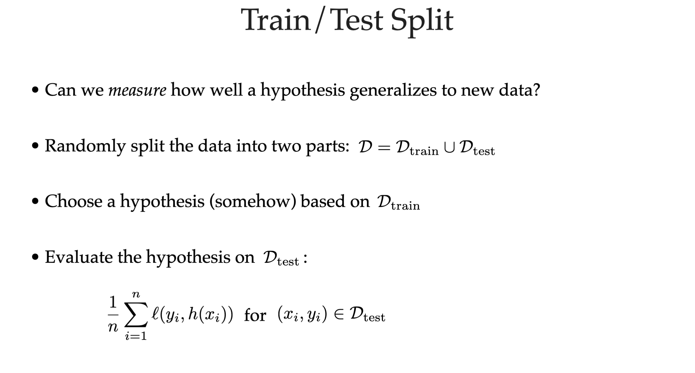

# Lecture 3 - Supervised Learning

## Math review

Remeber: `w dot x` is equivalent to `w^T x`

Tips: just regard hyper planes as 2D planes.

Hyperplanes are classifiers (0 is classified as -1, just by convention):

Same case in multidimensional case:

Homogenous linear classifier. If b == 0, it is a homogenous linear classifier. **What's interesting is that we can transform a d-dimensional non-homogenous classifier to a (d + 1)-dimensional homogenous classifier**:

> [!Note]
> "HS" means Halfspaces  
> Typo: the last line should be `||w|| = 1` not `||w_i|| = 1`

## Supervised learning setup

We have:

- Features: x ∈ 𝒳
- Labels: y ∈ 𝘺
- Data: D
- Model Class: H
- Loss Function: l
- Learning Algorithm that picks an h ∈ H based on d and l.

Supervised learning is the learning with labels y.

### Data and labels

### Loss functions

You should choose a suitable loss function. For example, the first loss function is bad if we are going to predict temp, and the predicted result is 76 ℉, while the real temp is 77 ℉. But it is a good loss function in classifier tasks.

> The loss of example above is 1 (the mis-classified blue point).

## Generalization

*We are not generating hypothesis that suitable for current data set, we are building hypothesis for unseen data* -> generalization.

All ML models are trying to answer this question:

Although you can train many models based on same training set and pick one that get highest score on test set. BUT! what if that model is just lucky? It may work bad outside our lab.

So, the best practice is "just use test set once". That is: when you are training model, set your test set aside, and protect it well. When it comes to the end, verify your model with the test set.

### Question

If you are building a spam filter, how to split your data into train/test.

If you randomly split a portion of emails as test set, it is actually not a good idea, because:

- What if there are only a very small portion of spam? Then a model just predicting all emails are "not spam" will get high score. But it is not a good model.
- Because the topics of spam may change during time (for example, Jan's are selling winter stuffs, while Nov's are selling Halloween's stuffs). If the data set is from Jan to Nov, it cannot predict well for Dec's emails.

So, you cannot turn your brain off! You should keep your brain on and design suitable training processes for different tasks.
