# Lecture 4 - Perceptrons

How to improve a classifier? (training)

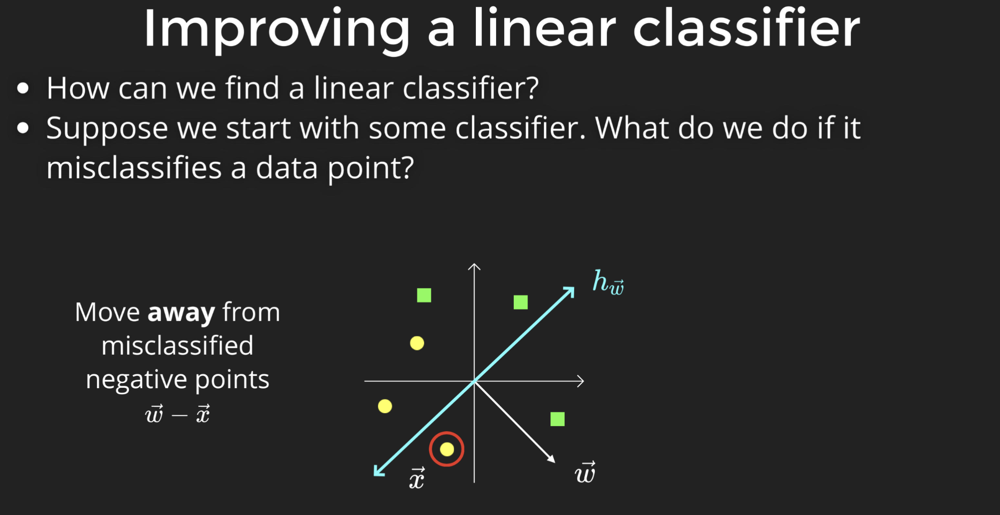
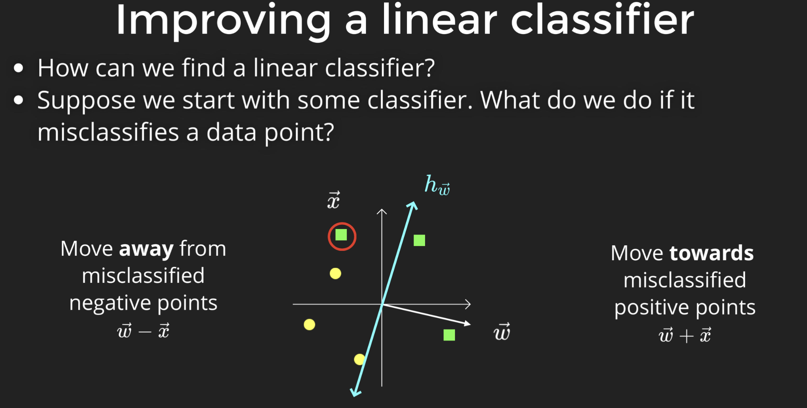

## Perception

Based on the algorithm above, we can design perception:
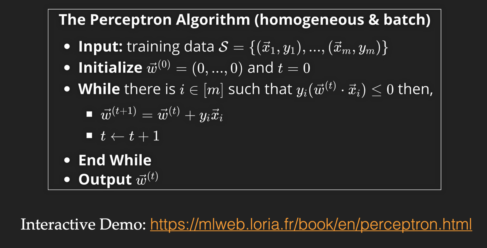

Here is an example of perception:
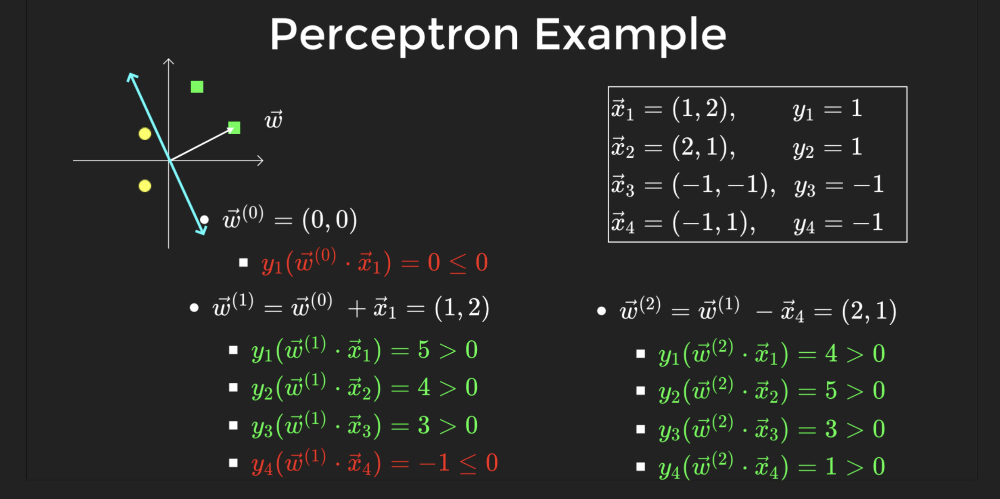

### Changing data order

What if we start with another point? -> It may make the convergence faster or slower. And it may lead to a different classification.
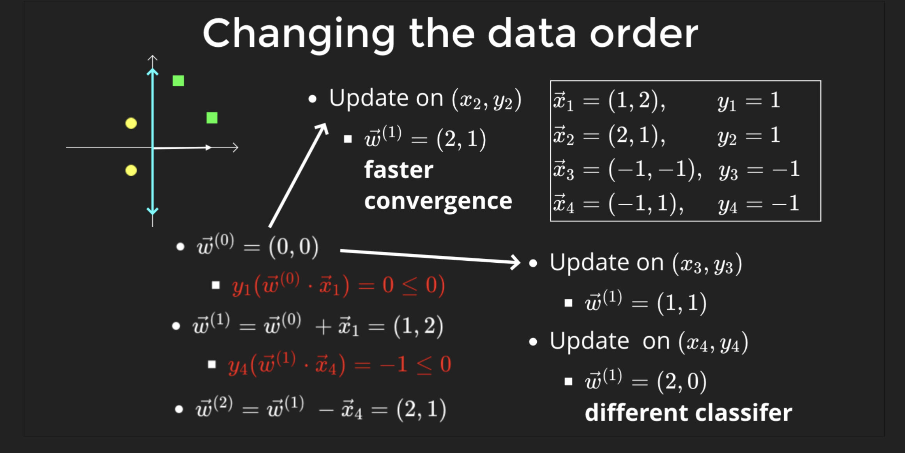

### Margin

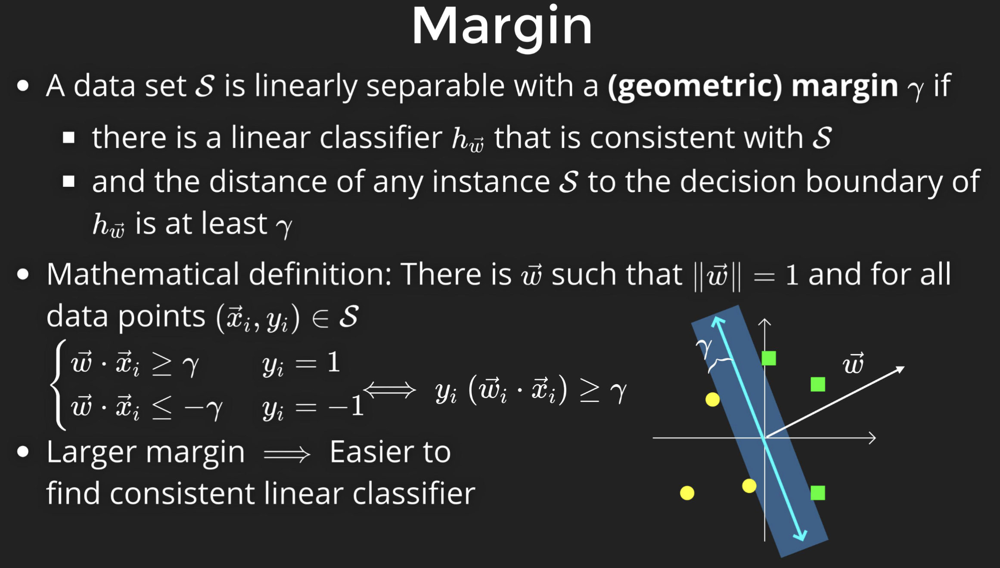

Q: What if the data is NOT separable? May go into infinite loop.

So, ***perception assumes that the data it handles must be separable.*** (Keep this in your mind! Otherwise, the following proof cannot hold)

### How fast to converge

How to proof will be covered in next section
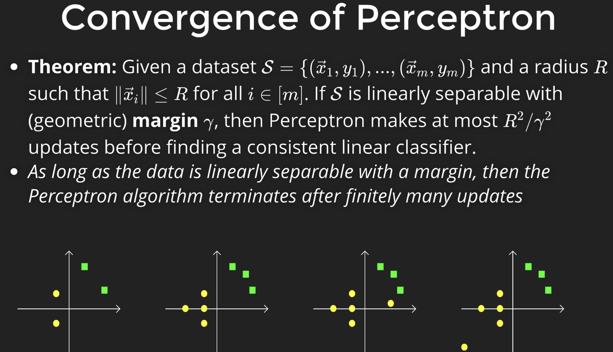

### Prove it

Assumptions:

1. Data is separable
2. $w^*$ is normalized

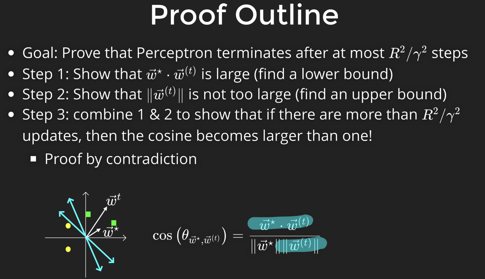

- Step 1: proof $<w^*, w^{(t)}>$ grows in each iteration (i.e. angle between $w^*$ and $w^{(t)}$ becomes smaller and smaller). ***We assume that $w^*$ is normalized.***
- Step 2: We have to control that $||w^{i}||$ won't be too large (otherwise, $<w^*, w^{(t)}>$ can be only because by increasing the length of $w^{(t)}$, rather than decrease the angle!)
- Sept 3: Combine and draw the conclusion.

### Step 1

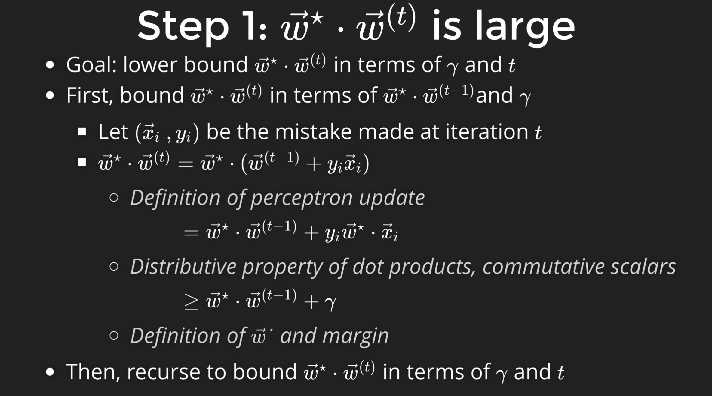
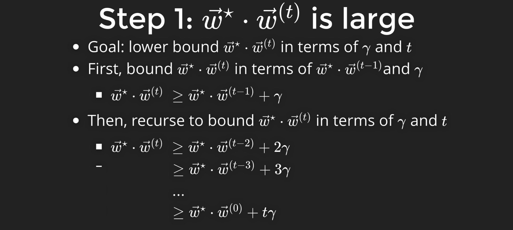

### Step 2

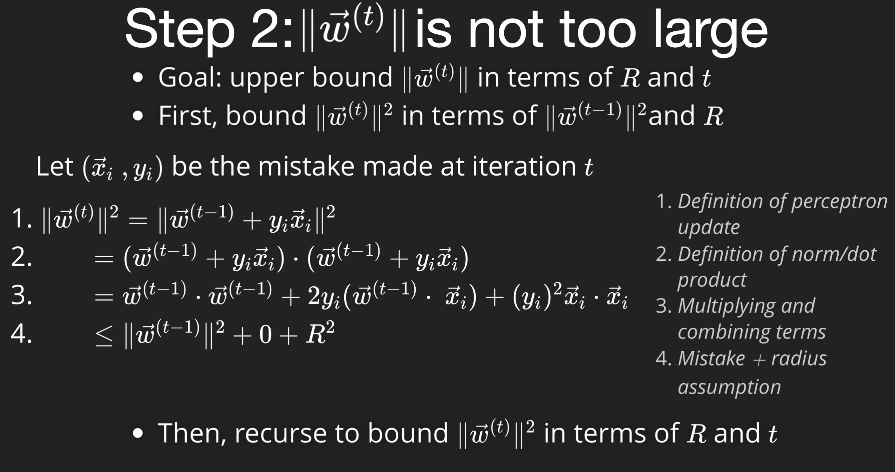
Why in 3 to 4, the middle term is 0?  
-> Because $(x_i, y_i)$ is a misclassified data, then $y_i(w^{(t-1)} * x_i)$ must be less than 0. So, we can replace it with 0 in the `<=` case.

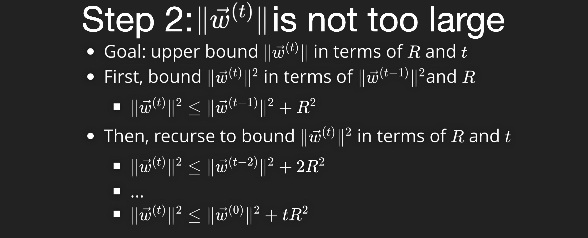

### Step 3

Combine Step 1 and 2:

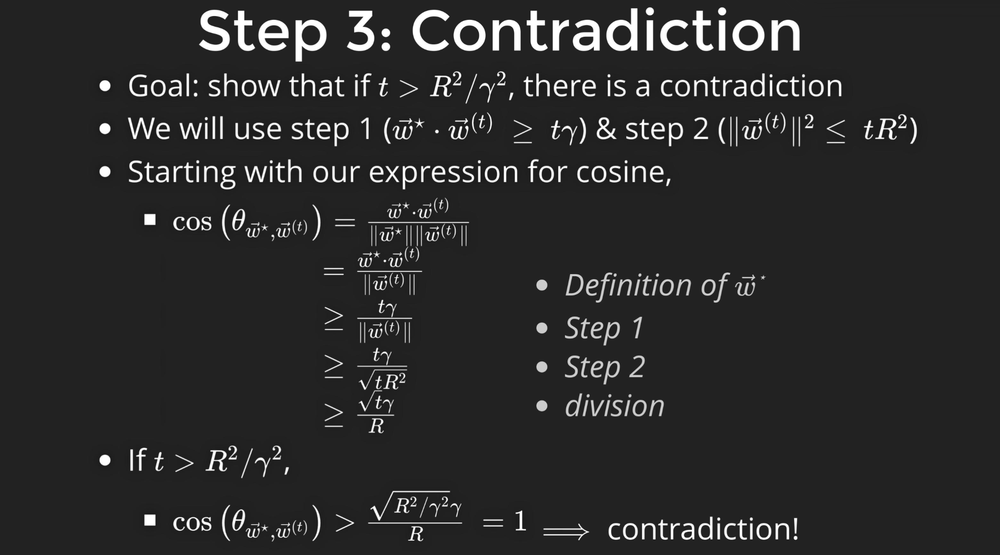

Q: what if we perform one more step after $R^2 / γ^2$?  
->There will be no misclassified data after $R^2 / γ^2$. So it won't renew $w^{(t)}$

### Remarks on convergence

Notice that R and γ are just geometry properties of data set. So, you can conclude how fast perception converge just by looking at data set!
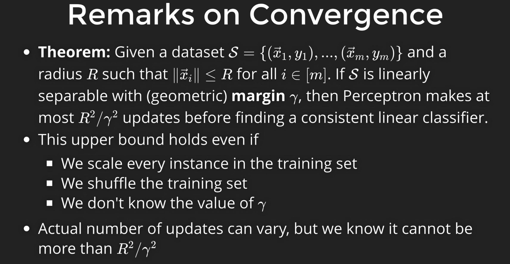
