# Lecture 5 - Support Vector Machines

[Slides](https://karthik-sridharan.github.io/3780fa26/SVM.html#1)

## Review

Perception can only be applied to binary classification.

e.g. in this example, '3' is labeled +1 and '8' is labeled -1. Each pixel is a dimension($x_i$) of input, not a whole input!
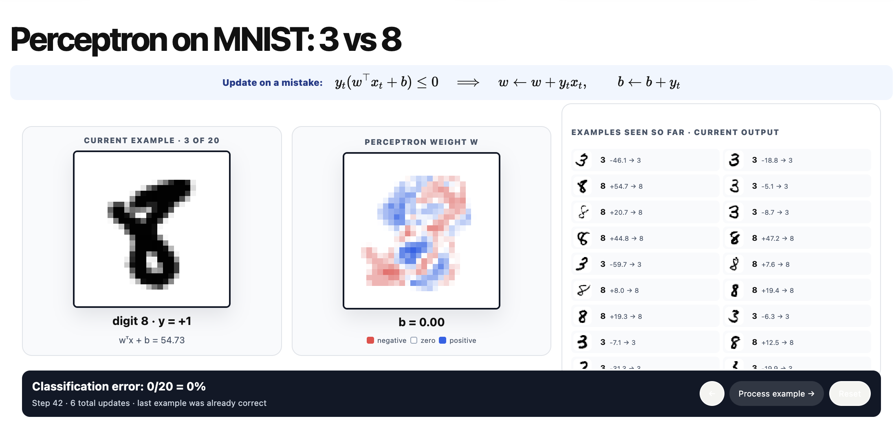

w and b determine how this hyperplane (in 2D, it is a line) moves: **w** determine both the **distance** from division plane to origin and **direction** of division plane, while **b** determine the **distance**.
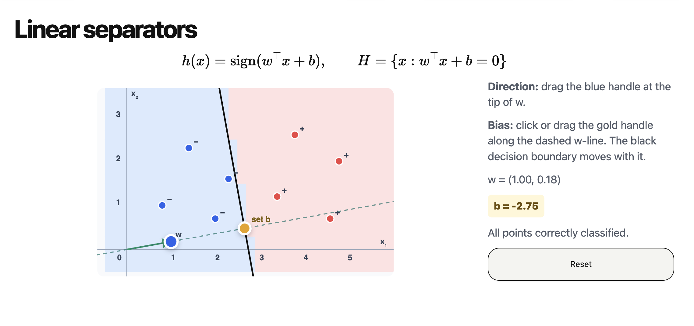

John's lecture tells us how many steps are needed at most if we want our perception to converge.
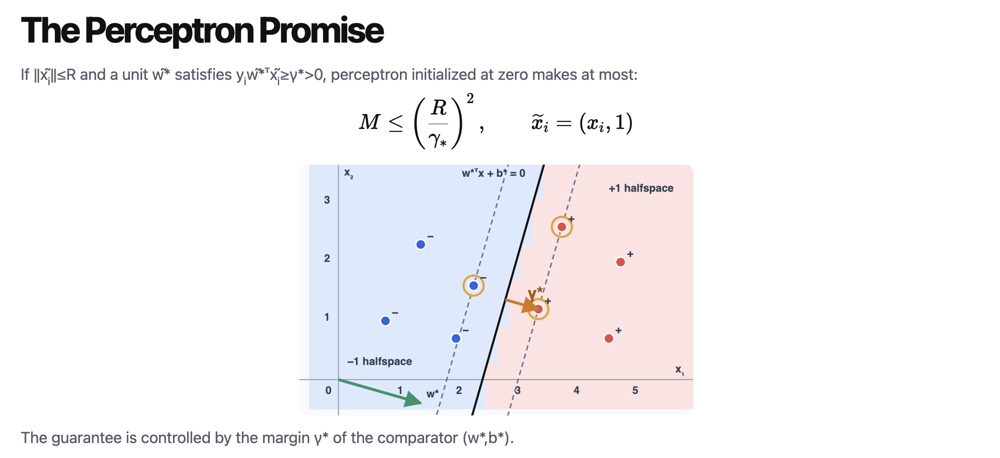

> [!Note]
> What perception says is that "if you promise me that a line with lambda exists we can find it within these steps". But it doesn't guarantee you find the best line (with greatest lambda).

## From perception to SVM

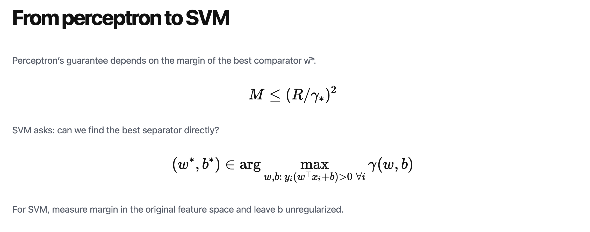

SVM gives you the best line (left), while perception just gives you lines (right).
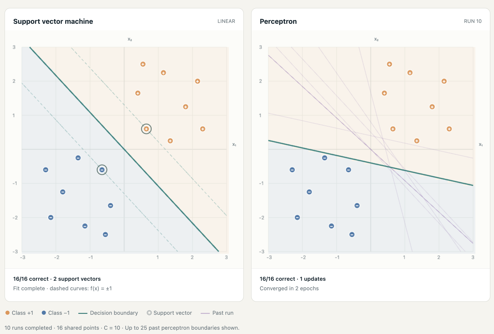

[Demo](https://karthik-sridharan.github.io/3780fa26/Demo/SVMvsPerceptron.html).

## Hard margin SVM

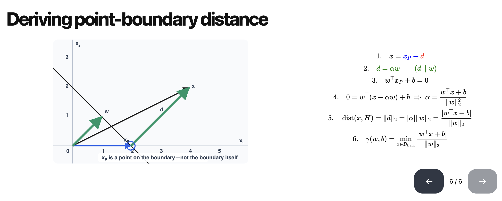
> $||⍵||_2$ is length of $⍵$. $||⍵||_2^2$ is the square of that length.

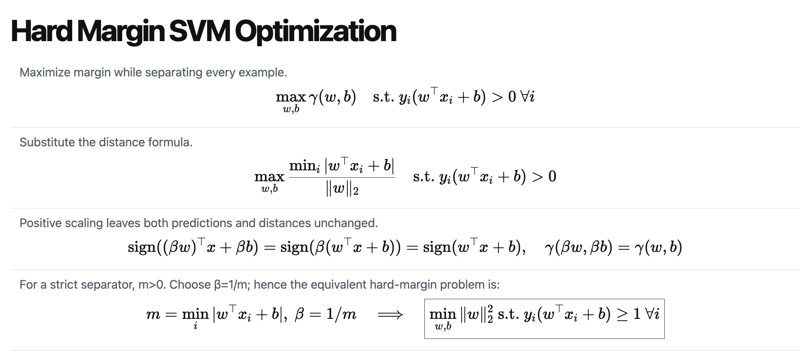
Line 3 is telling you that if you change w and b to βw and βb (where β > 0), it has no effect on

- Prediction (sign won't change)
- Distance ($|w^Tx_i + b|$ scales β, and $||w||_2$ scales β, too)

So, we can scale w and b (with same positive β) as we want! i.e. if (w, b) is a SVM result, then (βw, βb) is a also a SVM result.
> [!Note]
> The statement is correct if we don't consider normalized hard-margin SVM. If we use normalized hard-margin SVM ($ɣ * ||w||_2 == 1$), then β must be $1/m$ (shown below)

So, if we choose a $β = 1/m$ (m is $ɣ * ||w||_2$), we can get a equation like line 4. => Notice here that m will change with the change of β. So, when you choose β as 1/m, then the new m will become 1 ($||w||$ will also change to make sure ɣ won't change).

Notice $>=1$ here is because m (= 1) is the smallest distance times $||w||_2$, so every other distance times $||w||_2$ must be greater than m (= 1) times $||w||_2$.

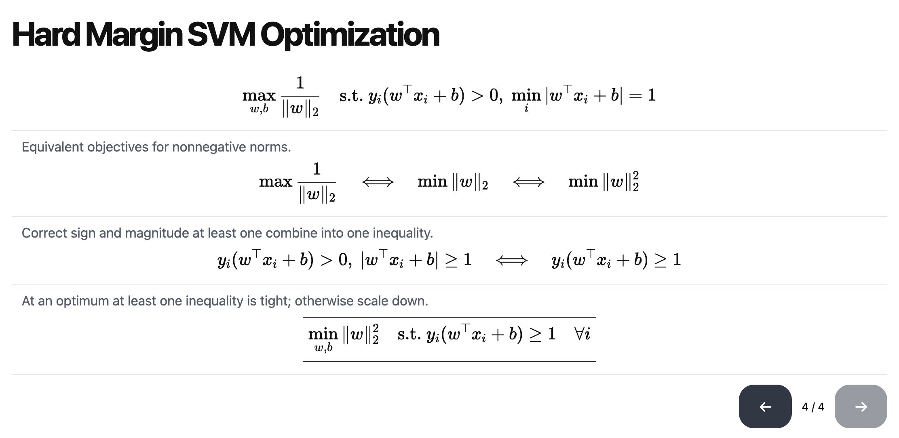
This slide is easy to understand, just remember that SVM is used for binary classification, and $y_i$ can only be +1 or -1.

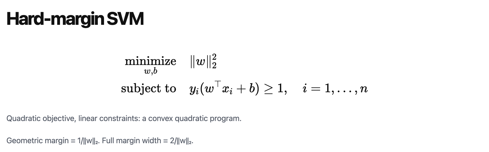

In the following image, support vectors are the vectors (points) circled by yellow circles. They are the point where $|⍵^Tx_i + b| = 1$. [Demo](https://karthik-sridharan.github.io/3780fa26/SVM.html#13):
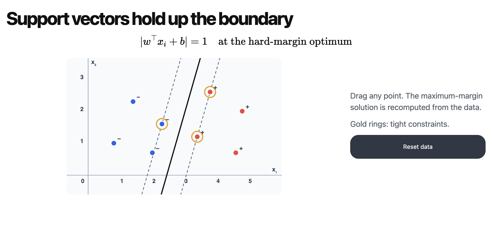

## Soft margin SVM

Then we may ask: What if data is not separable? -> We can allow some slack, but we hope the slack as small as possible.
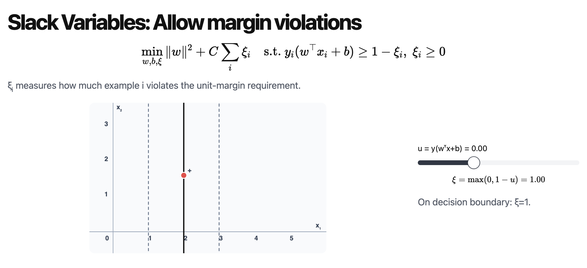
*$ξ_i$ (hinge loss) measures how much example i violates the unit-margin requirement.*

### Hinge loss

As we can see, if data set is separable, then $y_i(w^Tx_i + b) >= 1$ must hold, so, hinge loss must be 0. And soft margin SVM become hard margin SVM.

$ξ_i >= max(0, 1 - y_i(w^Tx_i + b))$ (according to s.t. part of last slide).
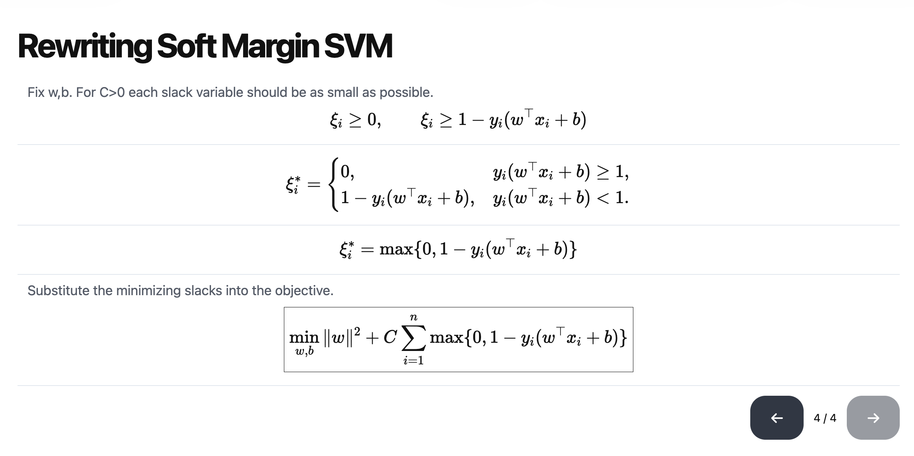

So, if point i:

- Is classified correctly, and outside margin (dash line region), then $ξ_i = 0$
- Is classified correctly, but inside margin (in dash line region), then $0 < ξ_i < 1$
- On decision boundary (on solid line), then $ξ_i = 1$
- Is classified wrongly, but inside margin, then $1 < ξ_i < 2$
- Is classified wrongly, and outside the margin, then $ξ_i > 2$

So, $ξ_i$ is a penalty, it tells you how bad your SVM classify point i. And C is a coefficient of $ξ_i$, it scales the penalty.

-> If C is super super large, it means we don't allow even small slack. On the contrary, if C is super small, it means we allow slack greatly. Watch demo on [this page](https://karthik-sridharan.github.io/3780fa26/SVM.html#18).

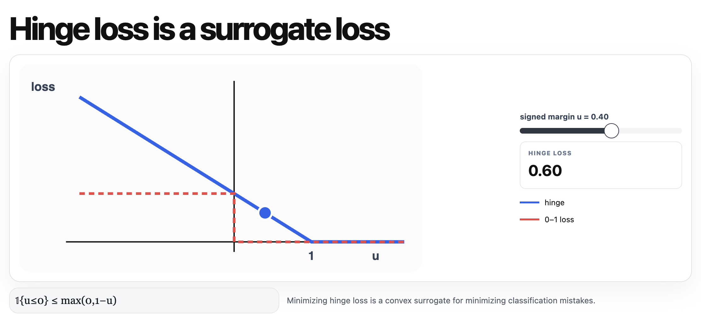

### Soft margin SVM summary

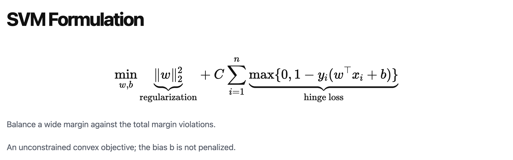

## Summary

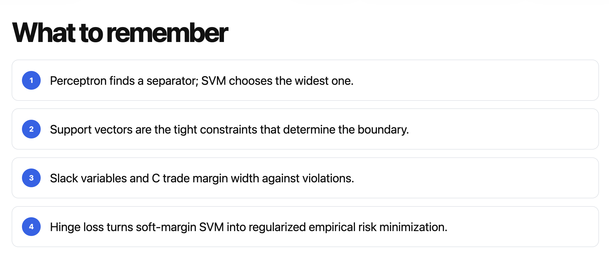
