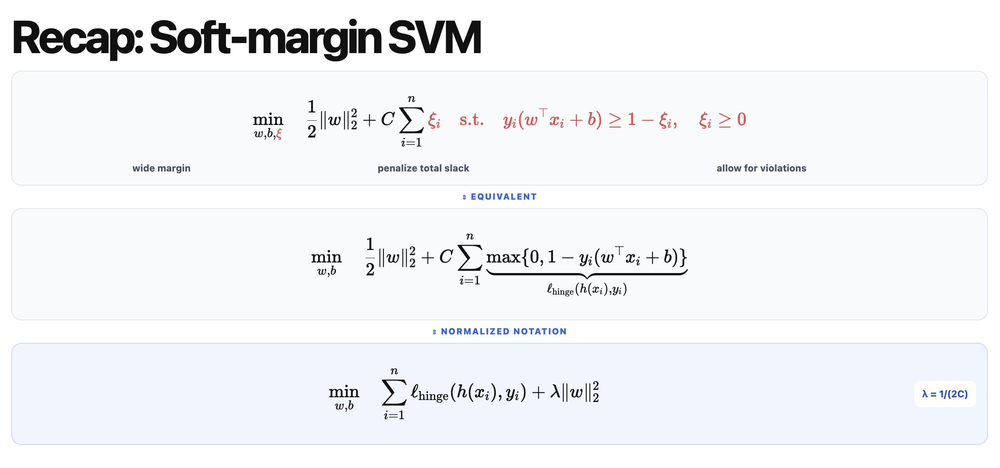
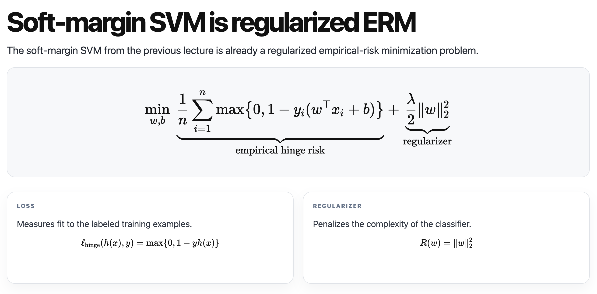
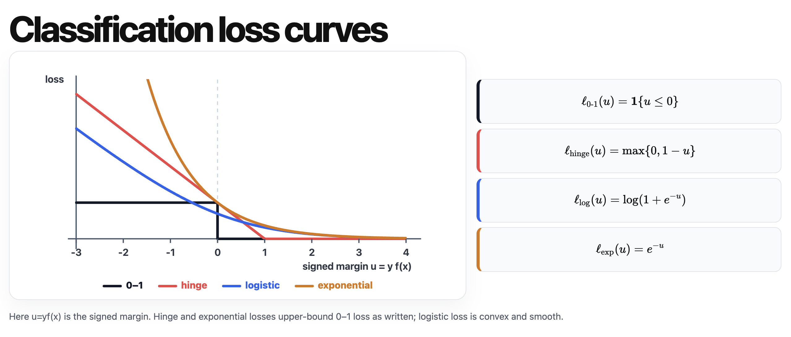
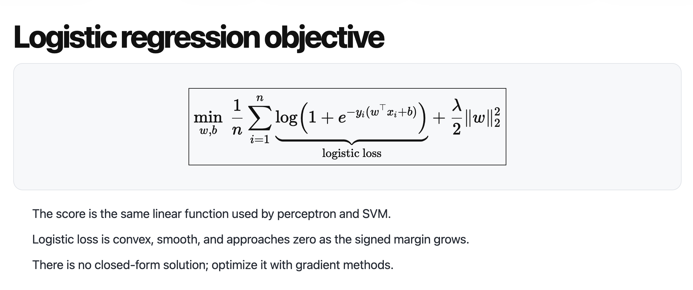
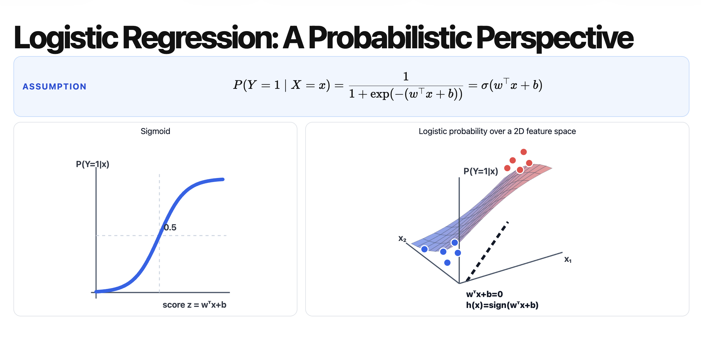
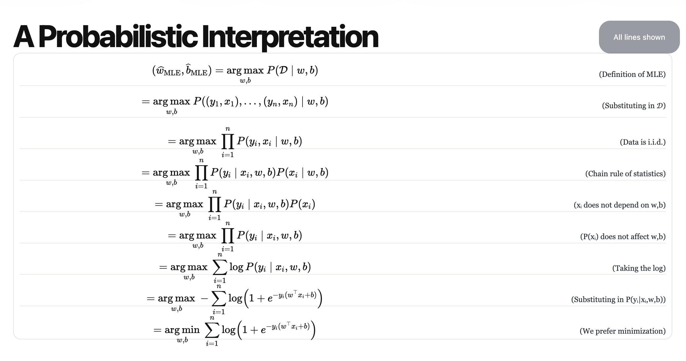
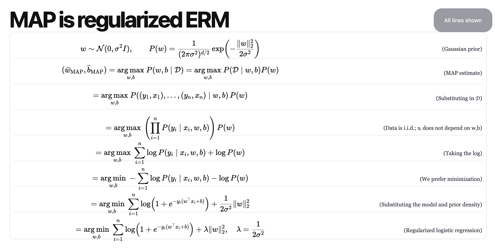
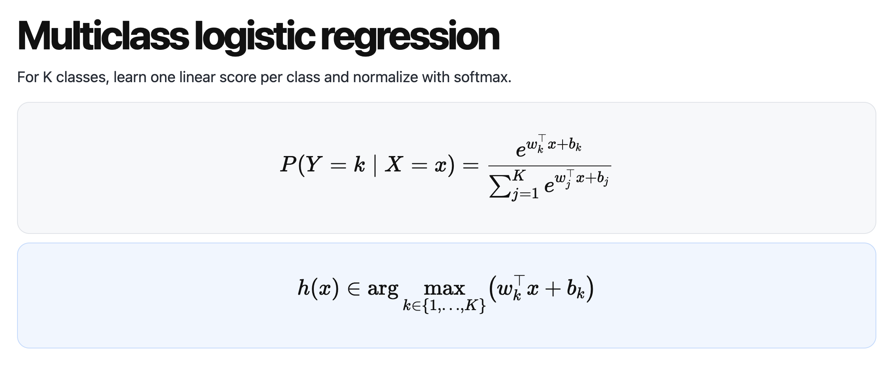
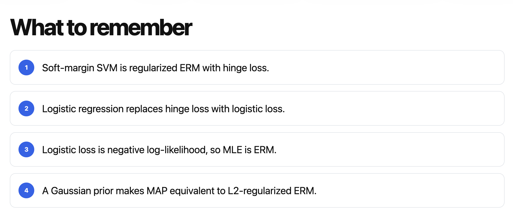

# Lecture 6 - Linear models, ERM and classification

Linear models, ERM and classification: from soft-margin SVM to logistic regression

[Slides](https://karthik-sridharan.github.io/3780fa26/Ermclass.html)

## Review soft-margin SVM

$ξ_i$ (hinge loss) is the budget you can spend on misclassified points. In last lecture, there is no 1/2, but since we haven't decide C, we can say $C_{new} = 1/2 C_{old}$, that's why, we can place 1/2 before $||w||_2^2$. The reason we add a 1/2 is because it makes the formula after derivative more concise.

Our goal is:

This is a regularized empirical-risk minimization (regularized ERM) problem. Where regularized means we want to *penalizes the complexity of the classifier*, i.e. make $||w||_2^2$ smaller. And empirical-risk means we have a loss function, which penalizes the misclassified data. And we want the model not complex and correct.

## Loss functions

For a regularized ERM problem, if we substitute (surrogate) the loss function, it may be easier to optimize.

We want to surrogate hing loss with logistic loss to it easier to differentiate. (Notice that hinge loss it self is also a surrogate loss. It surrogates 0-1 loss.)

Compared to hinge loss, logistic loss has better shape (convex) and can be differentiate at any position. Moreover, when x is close +∞ or -∞, logistic loss will be close to hinge loss.

## Logistic regression (mostly used in ML)

If we substitute hinge loss with logistic loss, then we are moving from SVM to logistic regression:
> [!Note]
> Although it is called "regression", logistic regression is actually used in classification problems (in ML).\
> *It is called regression because mathematically, it is linear regression—just performed on the log-odds (a continuous quantity) rather than directly on the discrete class labels.*

> [!Note]
> We use 1/n because in ML, we usually care about average training loss, rather than cumulative training loss.

Sigmoid function: $y(u) = 1 / (1 + e^{-u})$

### Probabilistic perspective of logistic regression

You may think that logistic loss is chosen arbitrary. But it has significant probabilistic meaning: if we choose logistic probability model, i.e. If we think ${P(Y=y\mid X=x,w,b) = \frac{1}{1+e^{-y(w^\top x+b)}}}$, then, if we apply MLE, then we can get logistic loss!

**Again: if we use sigmoid function as prediction (also called logistic probability), then both MLE and MAP tell us that logistic loss should be the most possible lost function.** That is, logistic loss has highest chance giving you logistic probability (the probability that follows sigmoid function).

> MLE: Maximum Likelihood Estimation, it choose the parameters makes the observation of data has highest probability.\
> MAP: Maximum A Posteriori Estimation, it tells you if you observe the data, how reasonable you parameters are (these parameters may be trained by previous samples or samples from elsewhere, so, we know they are not accurate, but we also know they are not inaccurate).

### MLE

MLE: choose a set of (w and b), and the probability of $P(D | w, b)$ is highest. It tells you that this set of (w and b) has higher chance to produce the observation:

But what if this set of (w and b) actually has is rare, they are extreme values (i.e. $||w||_2^2$ is large)? -> That's when MAP trying to solve.

### MAP

MAP: choose a set of w and b, and make $P(w, b | D)$ is highest. It assumes that w follows gaussian distribution $N(0, σ^2I)$ (it means that the real w should be not very far from 0, and we will punish it if it is far from 0).

## Multiclass logistic regression

Probability is softmax:

## Summary

## Next class

Regression.
