# Lecture 7 - Linear Methods: Regression

[Slides](https://karthik-sridharan.github.io/3780fa26/Ermreg.html)

## Recap

Regularized ERM:
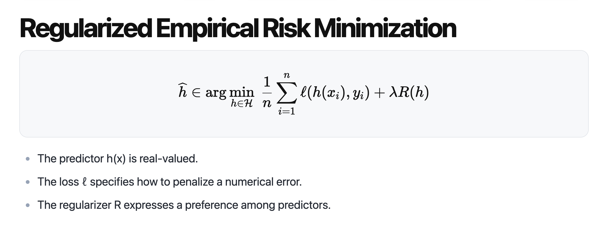
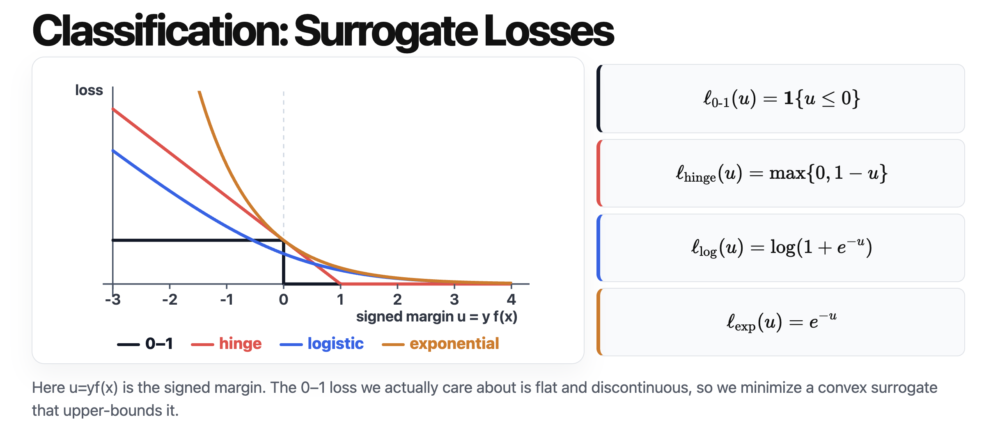

## Regression

From classification to regression:
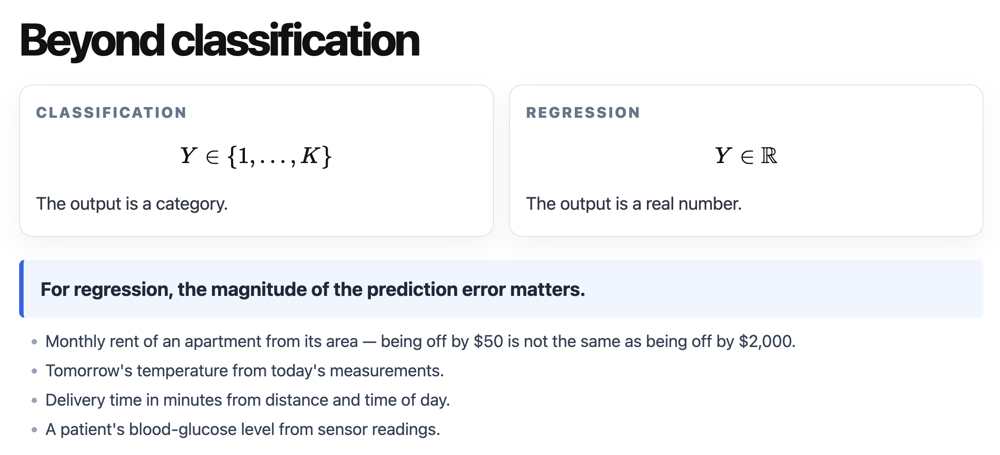

Here are some loss functions of regression (different from the classification losses above):
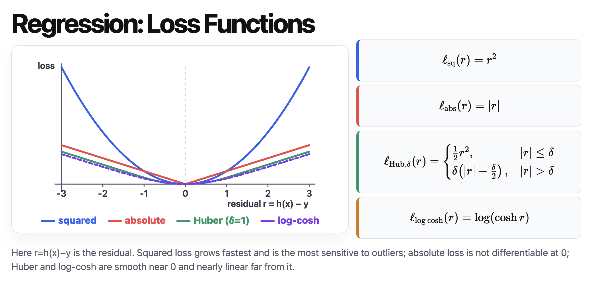

In regression, y here is a real number rather than 1 and -1. And we just need to replace the loss function in ERM to the loss functions of regression, then we are solving regression problems:
$$\widehat{h} \in \arg\min_{h \in \mathcal{H}} \frac{1}{n} \sum_{i=1}^n \ell(h(x_i), y_i) + \lambda R(h)$$

Here, $\arg\min_{b} \mathbb{E}[(Y - b)^2]$ is $\arg\min_b \frac{1}{n} \sum_i(b - y_i)^2$, it gives you $b = \mathbb{E}[Y]$. And the second formula gives you $b \in Medium(Y)$, $\in$ means there may not be only one Medium of Y:
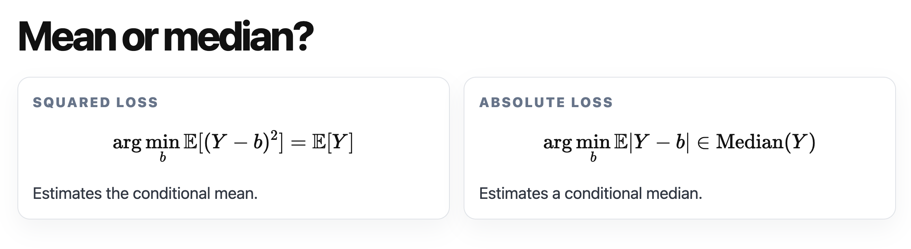

Minimize different loss function may give you different result: [demo](https://karthik-sridharan.github.io/3780fa26/Ermreg.html) -> square loss function care a lot more about extreme outliers. Absolute loss doesn't care about extreme outliers. Huber is in between square and absolute losses.

The following images show the different results given by these 3 methods:
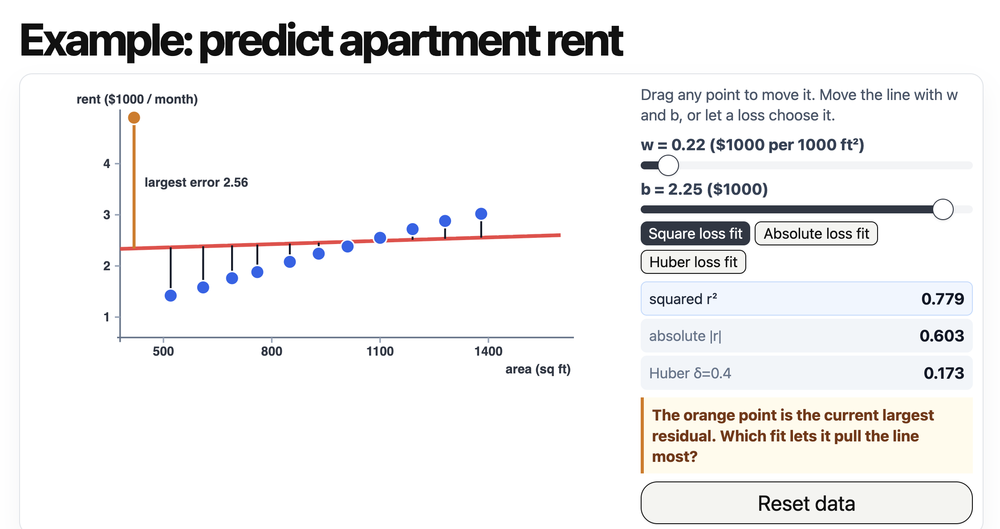
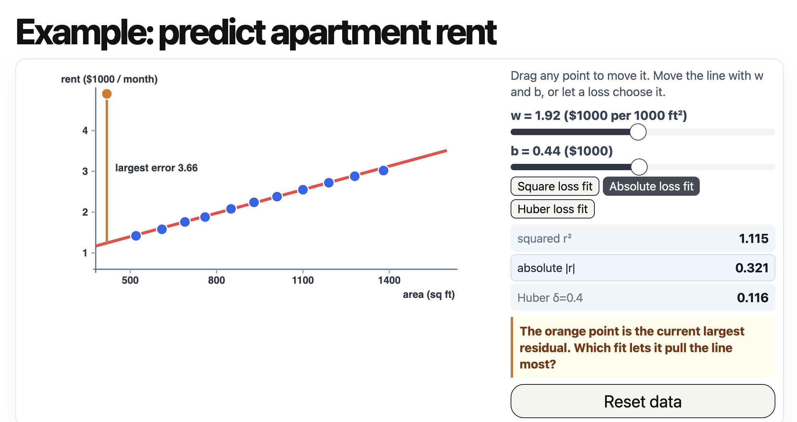
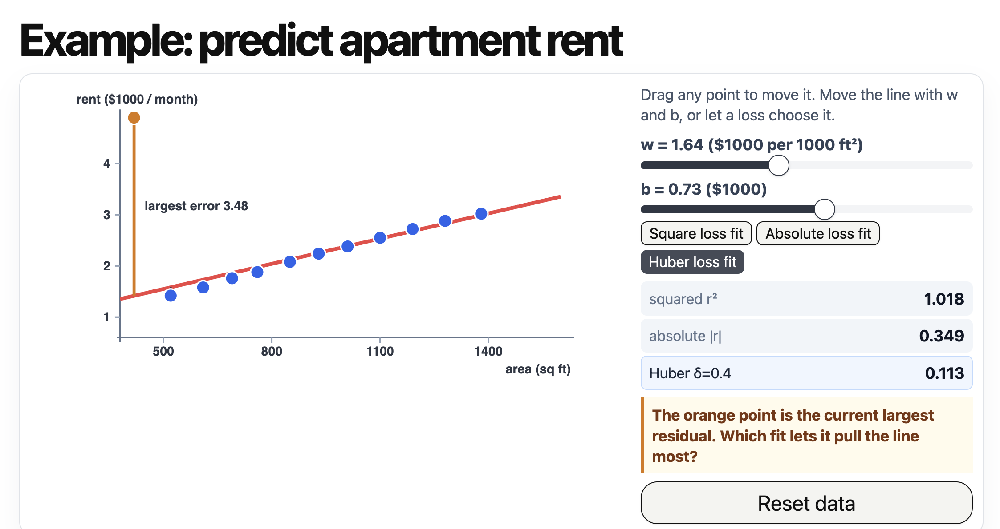

## Probabilistic perspective

Note: here we assume $x \sim \mathcal{N}(w^Tx + b, \sigma^2)$ obey gaussian distribution
> [!Note]
> Notice this is not distance, it means $y - (w^Tx + b) \sim \mathcal{N}(0, \sigma^2)$\
> i.e. $P(y_i | x_i, w, b) = \frac{1}{\sqrt{2\pi\sigma^2}} * e^{-\frac{y_i - (w^Tx_i + b)}{2\sigma^2}}$

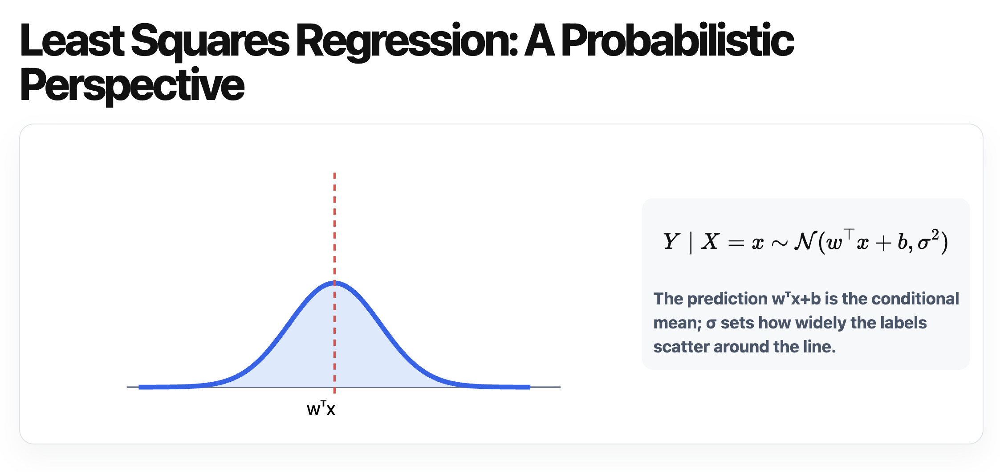

With the assumption above, we then apply MLE, we can get square loss!
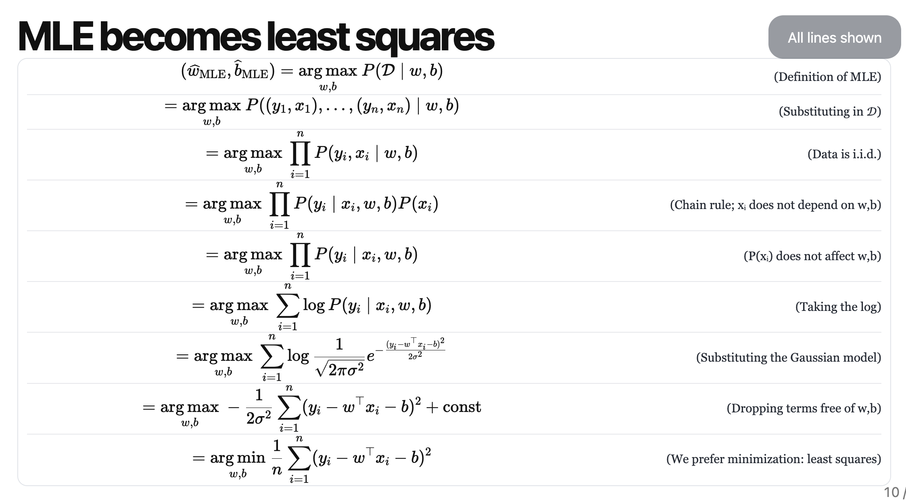

From line 1 to line 6, these steps apply to all MLE (same as last [lecture](./Lecture_6.md/#mle)). So, in the prelim, you can skip these steps. Line 7 is where we start to apply our assumption. As we can see, the square comes from the square in gaussian distribution.

In conclusion: we prefer square loss function to absolute loss function because Gaussian distribution can lead to it (and Gaussian distribution is more common). And no matter the variance of Gaussian (σ), we have same target to optimize (the last line is irrelevant to σ).

[MLE and MAP](./Lecture_6.md/#probabilistic-perspective-of-logistic-regression)

Here is a typo in the following image, the last line is $w_{ridge}, b_{ridge} = ...$
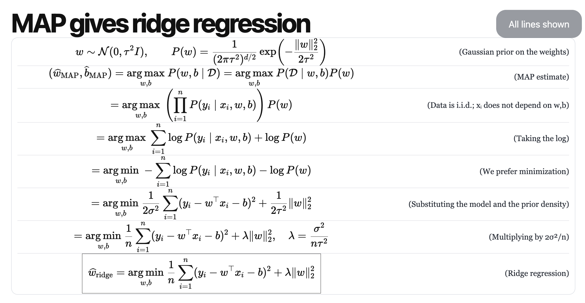

Next homework will ask you to prove this:
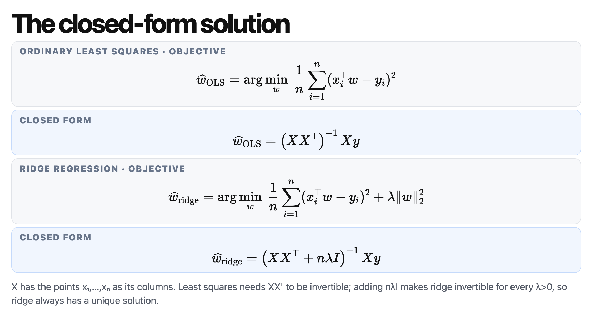

## Regularizer choice

Ridge: *Strictly convex and differentiable, but every weight stays non-zero: dense solutions.* ("dense" means almost all dimension of w are not 0).
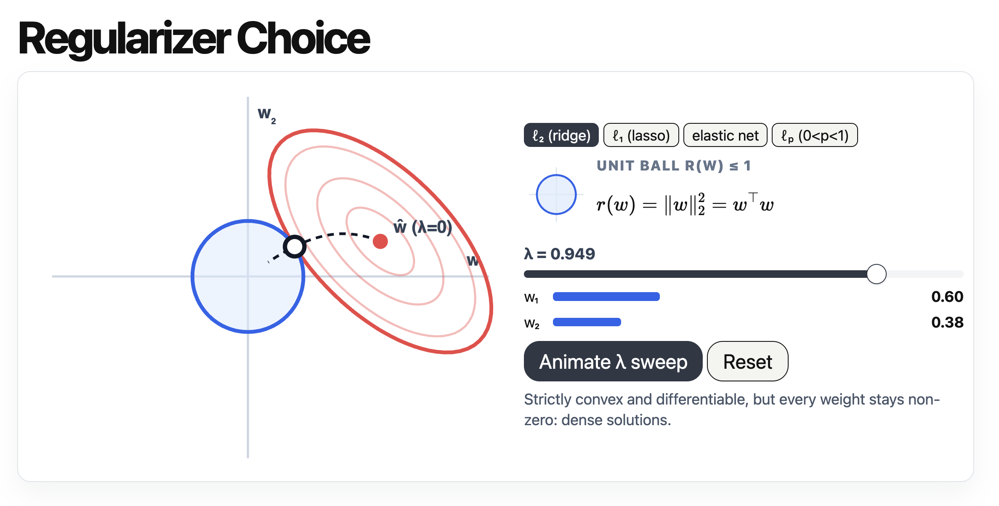

Lasso: *Convex but not strictly; not differentiable at 0 — which is exactly why it produces sparse solutions.* ("sparse" means a lot of dimension of w are 0)
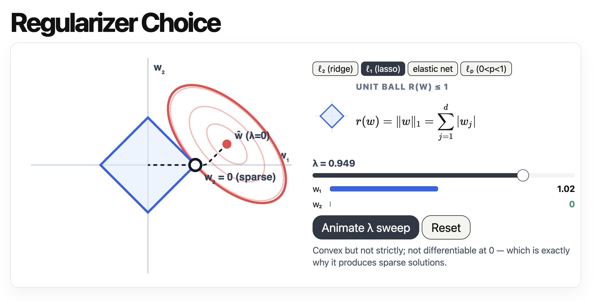

Elastic net: *Strictly convex (unique solution) and still sparsity-inducing; here α=0.6.*
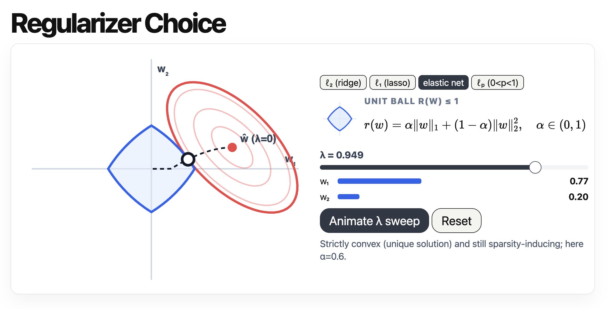

$\mathcal{l}_p$: *Non-convex and not differentiable; very sparse, but the solution found depends on initialization. Here p=0.5.*
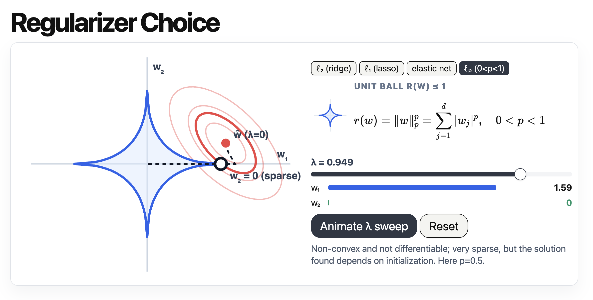

## Prior and regularizer

Prior: the probability distribution of w.

Changing the prior will change the regularizer:
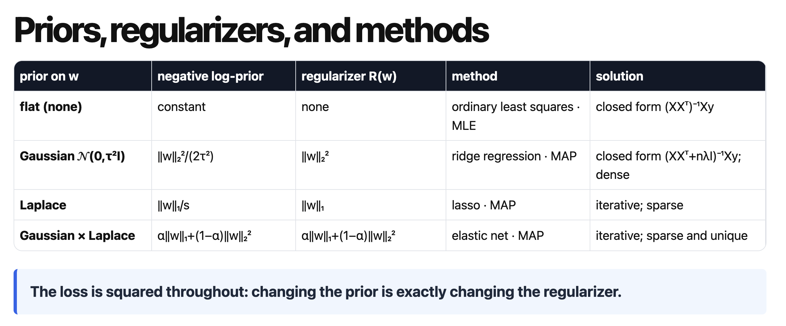

## Summary

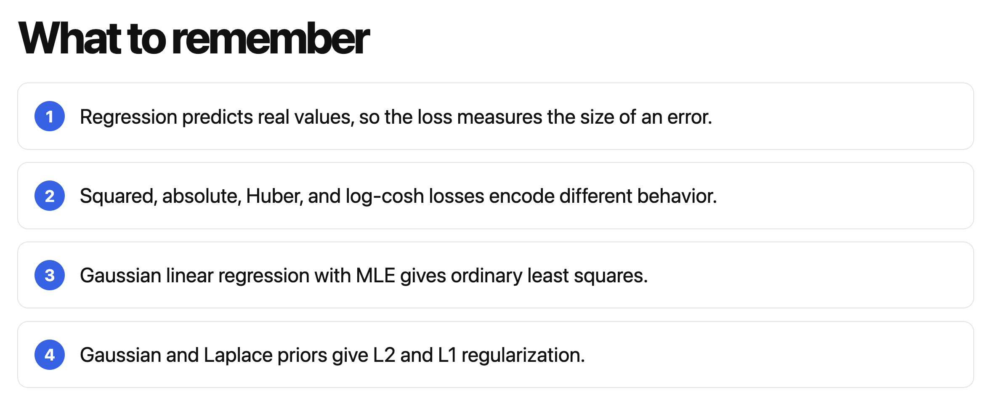
