# Lecture 8 - Gradient Descent

[Slides](./slides/Lecture_8-gradient-descent.pdf)

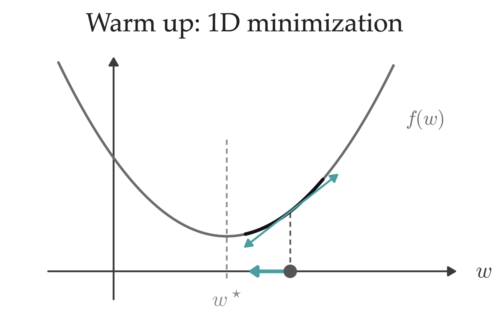

## Minima and Convexity

Definition of convex function and minima:
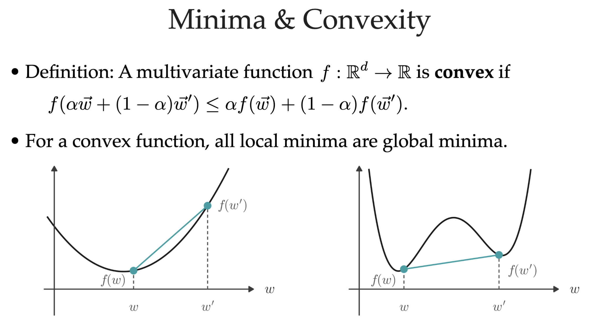
Convex: $f(\alpha w_1 + (1 - \alpha) w_2) <= \alpha f(w_1) + (1 - \alpha) f(w_2), \forall w_1, w_2$ \
Minima: local lowest point

As shown in left picture: *For a convex function, all local minima are global minima.*

## Review

### Partial derivatives

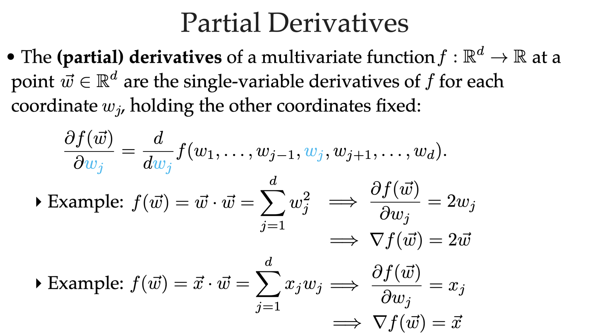
$\nabla f(w)$ is defined in next slide:

$\nabla_w = [\frac{\partial}{\partial w_1}, \frac{\partial}{\partial w_2}, \dots, \frac{\partial}{\partial w_d}]^T$
> [!Note]
> **$\nabla_w$ has same shape as w**, I use transpose above because w is a column vector (not because $\nabla$ asks us to transpose the result).

### Gradient

Here are the definitions of gradient and critical points
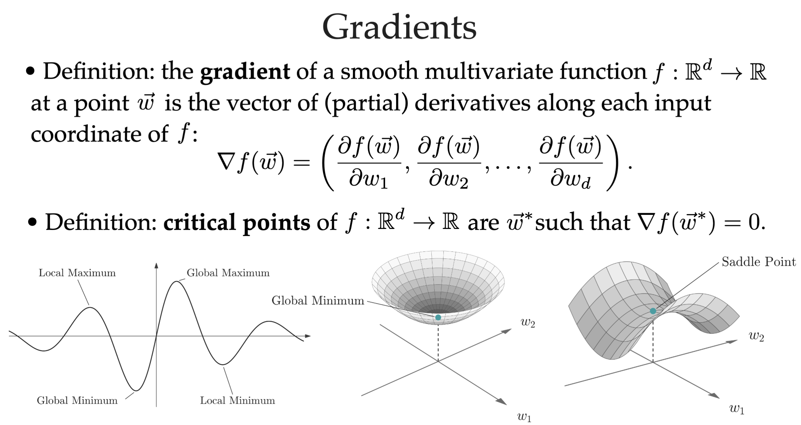

Please note that:

1. Gradient is the direction where function **increases** fastest.
2. Critical points are where $\nabla f(w) = 0$ (or undefined), it is just **candidates** of minima and maxima, but it doesn't necessary be (it could be, but not 100% be).

## Gradient descent

Convexity tells us that the second derivative of $f(w)$ (i.e. $\nabla^2 f(w)$) is no less than 0 (>= 0). We can use it to prove the following statement:

The following picture shows how we know if a smooth function is convex or not. And why we want to know if a function is convex (because *For a convex function, all critical points are global minima*).
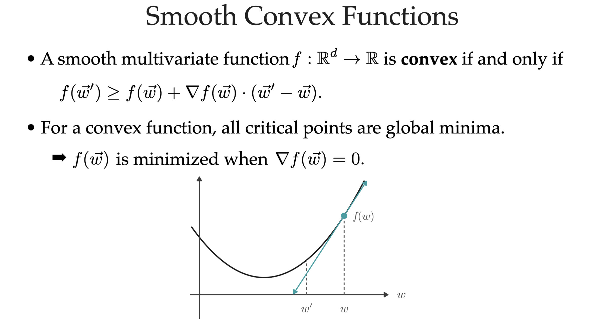

And we get gradient descent: **if we know a function is convex**, then we move to the opposite direction of gradient (gradient descent), finally we can get the minima:
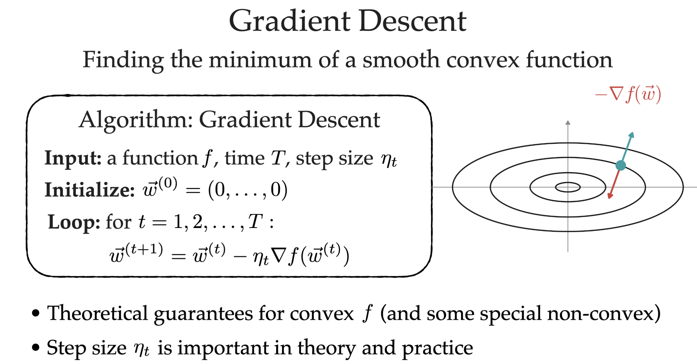

The last step is derivative to w, not x or y (because we want to train w). Here is an example, applying gradient descent to linear regression (least square):
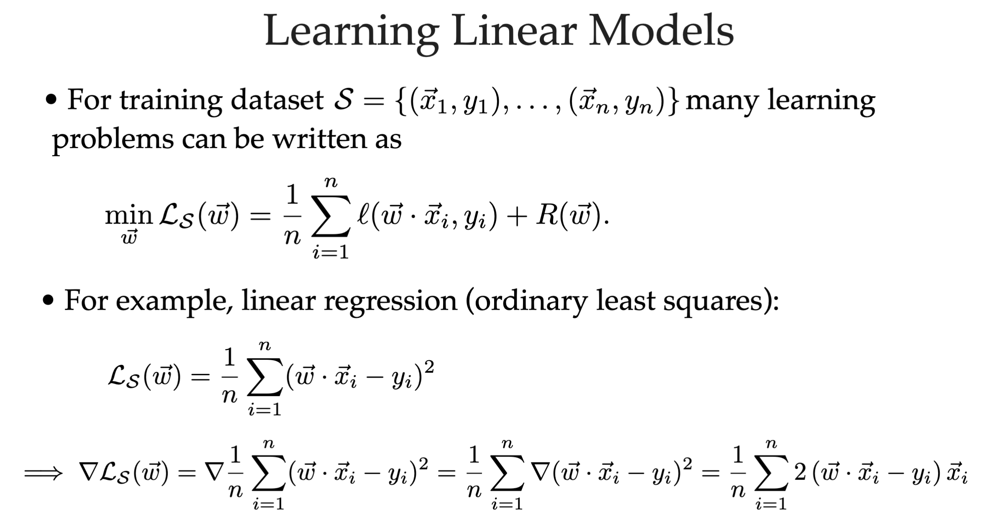

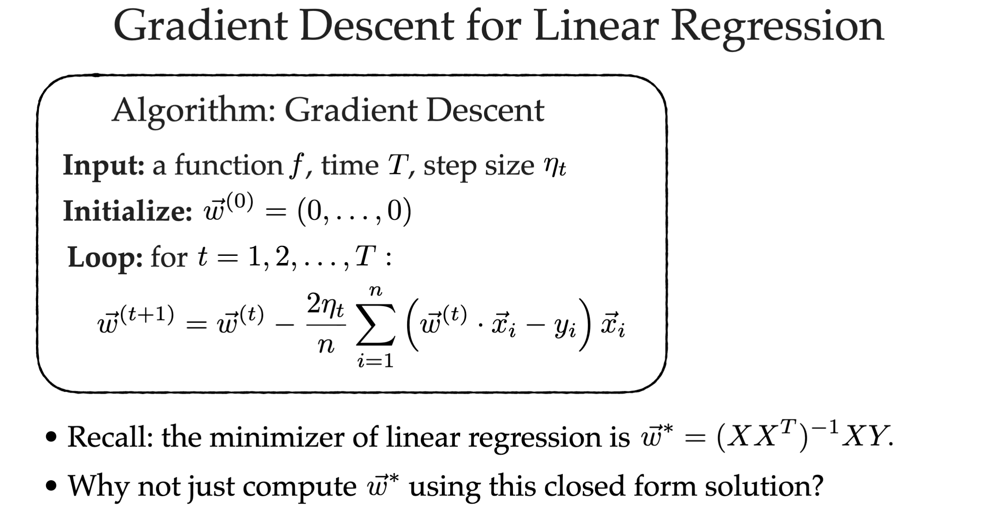

Q: Why don't use algebra -- set gradient = 0, and solve the function (for linear regression, the result is $w^* = (XX^T)^{-1} XY$)?

1. If it is not linear, this method always cannot be solved
2. Calculating inverse is expensive
3. If we have a large amount of features (i.e. d is large), then the matrices cannot fit in RAM

> Ref: [Midterm Jeopardy, Linear Methods and ERM 50 points](https://karthik-sridharan.github.io/3780fa26/midterm_jeopardy_2025-solutions.html)

### When stop

When the mode of gradient is small enough: loop while $||\nabla f(w^{(t)}) >= \delta||$
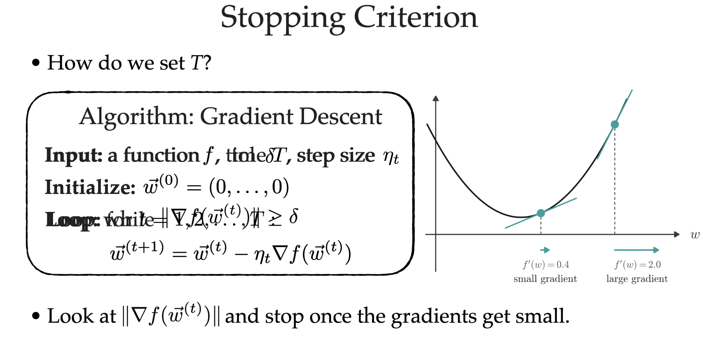

Q: will it fall into infinite loop? -> if step is too large possible. If each step is small, it must satisfies stopping criterion in the end.

### Large-scale optimization

When data set is too large, we cannot calculate gradient for every data point just to update w only one step (**batch gradient descent**). So can use [**mini-batch gradient descent**](#mini-batching):
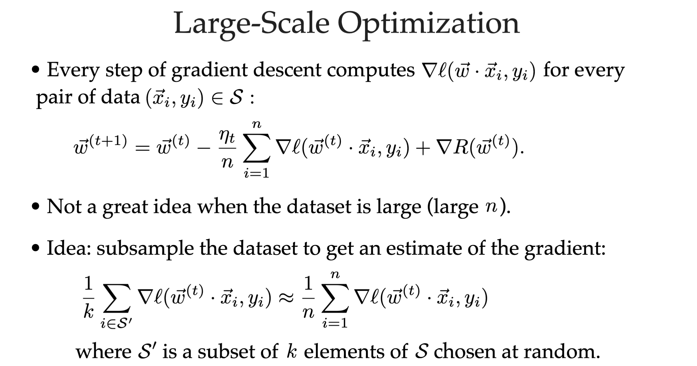
> $\ell(w^{(t)} \cdot x_i, y_i)$: loss function; R: regulation term

Goal: make the first formula as efficient as possible. (image there will be 50 trillion pairs of x and y, if we use batch gradient descent, it will take long before updating one step).

The idea of mini-batch: train based a subset of data set.

## Stochastic gradient descent (SGD)

In the example, let set k = 1. So every step, calculate gradient descent based only on one data point!

When you do gradient descent to all points, it is a **"epoch"**. Then reshuffle and start next epoch.
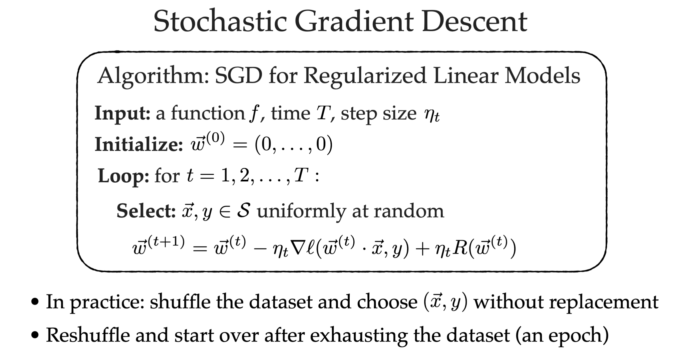

### Justification SGD

Why SGD works? Because its exception is batch GD.
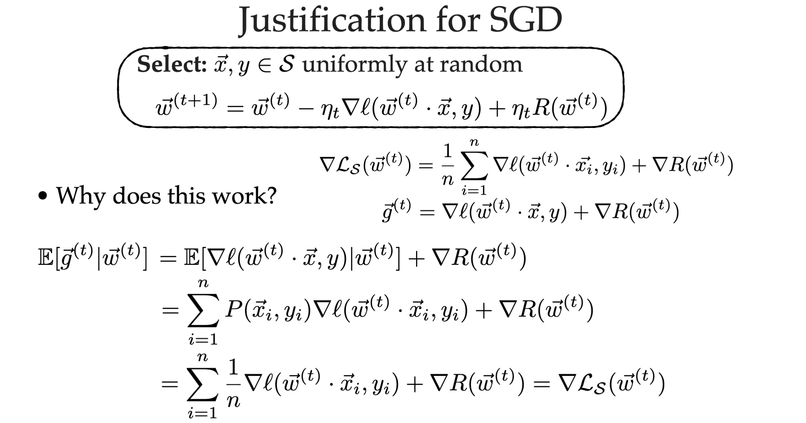
> Notice that the expectation is over x and y, not w.\
> Last step uses: $P(x_i, y_i) = 1/n$

We proved that the **expected value** (bottom) of SGD is same as gradient decent of whole dataset (right), which is our goal!

That's why we can use SDG in large-scale optimization.

### Example: SGD for SVM

SGD + SVM looks like perceptron, you can think of perceptron as SGD + SVM
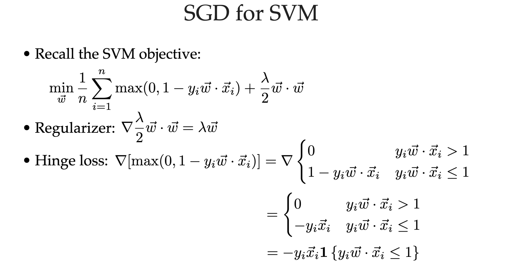
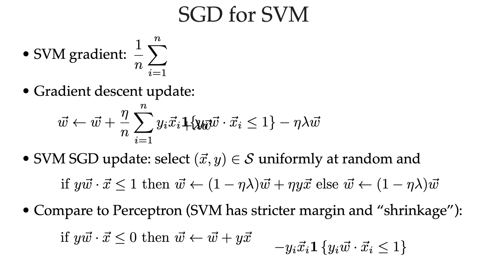

## What if function is not smooth

Use sub-gradient.
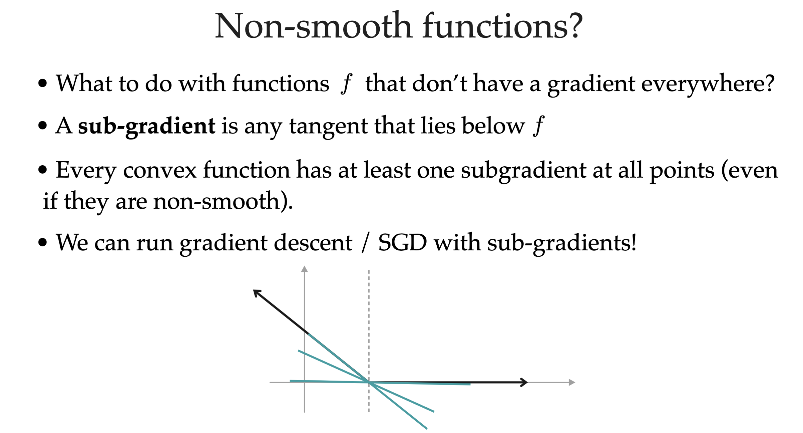

## Mini-batching

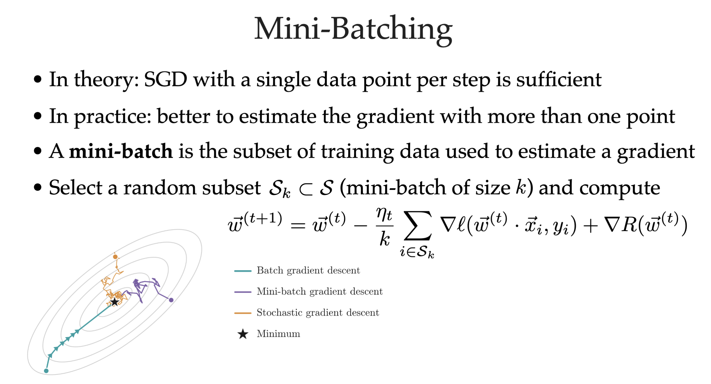

## How to choose step size

Your step size should not be too small or too large
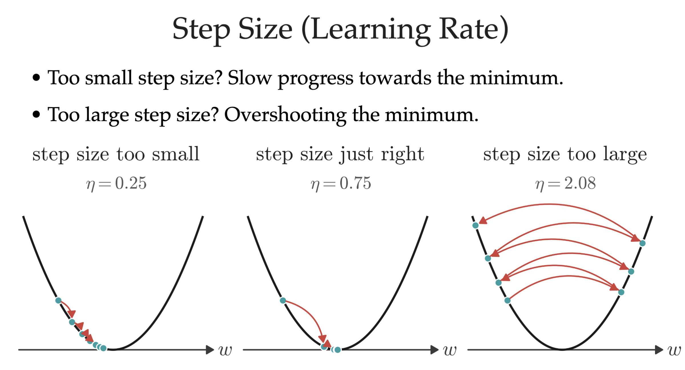

## AdaGrad

What if step size can also be trained:
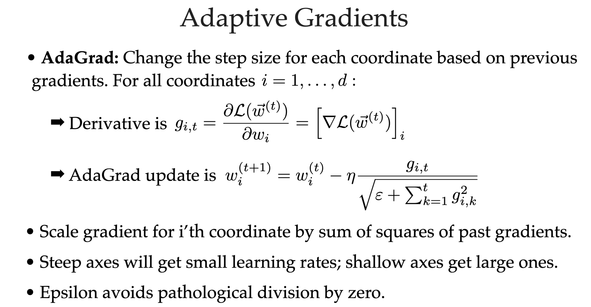

### Summary

Please differentiate:

- [Gradient descent (GD)](#gradient-descent)
- [Mini-batch GD](#mini-batching) / [Stochastic GD](#stochastic-gradient-descent-sgd)
- [AdaGrad](#adagrad)
- [Momentum](./Lecture_9.md/#nesterov-momentum)
- [Adam](./Lecture_9.md/#adagrad--momentum--adam)

## Question

Can have multiple discrete minima?
