# Lecture 9 - Gradient Descent II

How to know a single variable smooth function convex or not (here is a typo: a smooth "single variable"...):
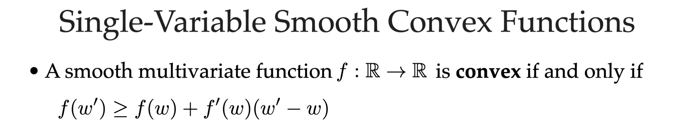
Multi variables:
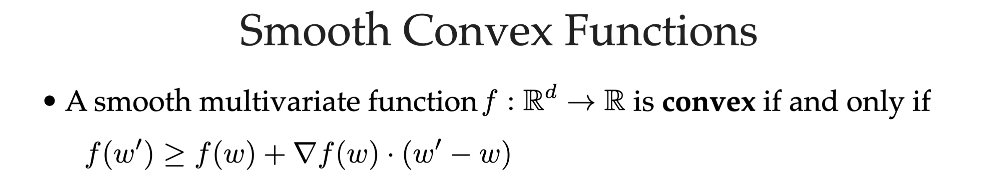

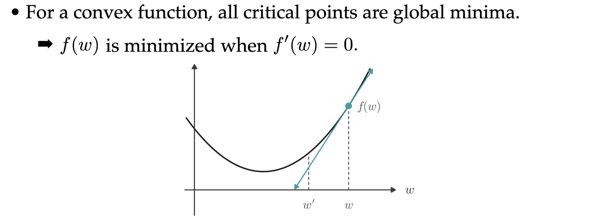

## Smoothness

In this part, we will forget about convexity. Let's focus on "smooth". We will quantify smoothness: L-smooth

### Smooth descent

Why care about L-smooth? -> if it is L-smooth, and we choose a step: $η_t < 1/L$, then it must decrease in each step! It is called **smooth descent**:

$f(w^{(t+1)}) \leq f(w^{(t)}) - \frac{\eta}{2}||\nabla f(w^{(t)})||^2$
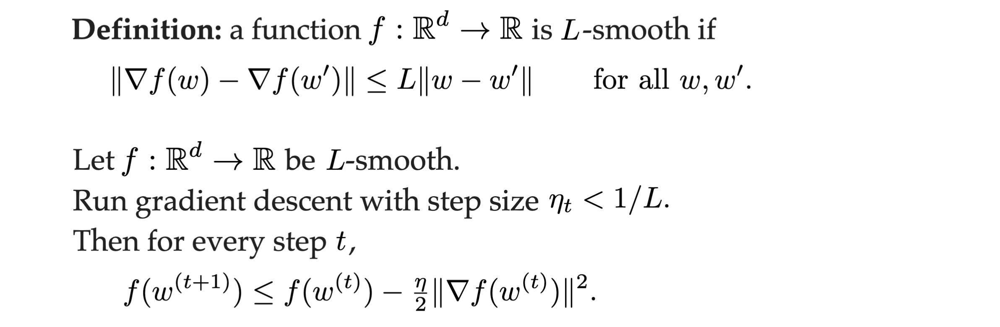

You can try to prove it. Here we just use this conclusion and Lemma to prove a convergence theory:

1. [Prove Lemma](#prove-lemma), this part only uses L-smooth, it don't need convexity
2. [Prove it](#prove-convergence), this part combine Lemma and convexity to prove this convergence statement.

### Visualize L-smooth

For every point w, if the whole $\nabla f(w)$ lies in the cone (the region between these 2 lines: slope = L and slope = -L), then L is satisfied.
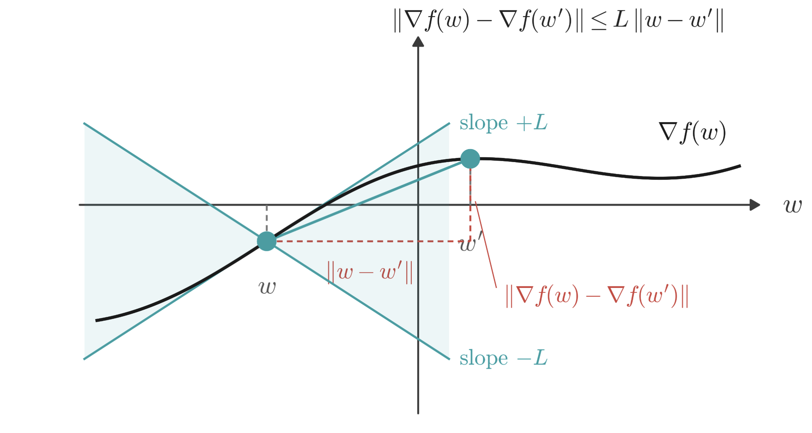

If we choose a too small L (let's write it as "M"), then it won't satisfy.
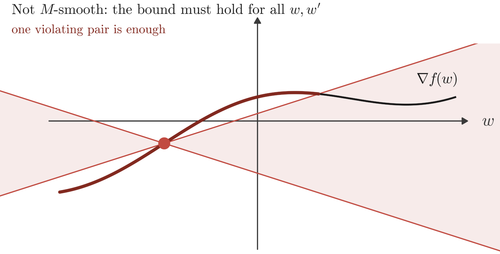

> L is just a constant, and we need to find the L (for some functions, L doesn't exist)\
> Small L means the function is smooth, so you can choose a greater step.

### Lemma

You can try to prove it (or read the [following part](#prove-lemma)): if $η_t < 1/L$, then we can make progress every step (it is called *Lemma*).

> "Lemma" is just the name of this statement

Lemma means, the whole function lies between the tangent line $\pm$ a quadratic function $\frac{L}{2} ||w' - w||^2$

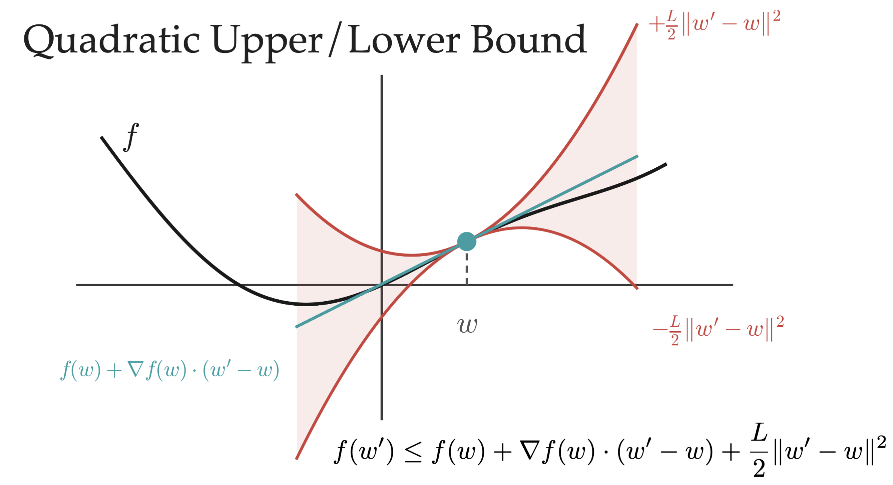

### Prove Lemma

To prove it, we just need to consider a 1-D version:
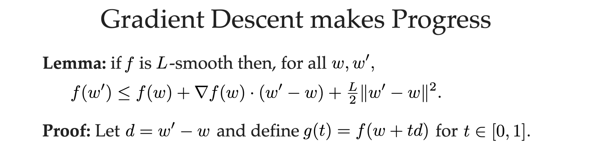

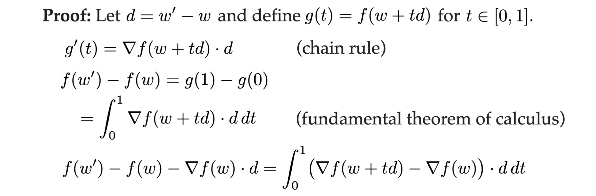
Why last step is possible

1. $\nabla f(w) \cdot d$ is irrelevant to t
2. integral is linear operation
3. $a \cdot c + b \cdot c = (a + b) \cdot c$

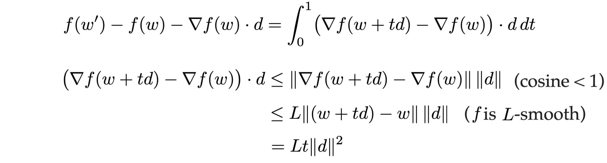
Why second line is true: it is Cauchy–Schwarz inequality, or more intuitively, $||a \cdot b|| = ||a|| \times ||b|| \times \cos(θ) <= ||a|| \times ||b||$; Third line is definition of L-smooth; Forth line is just simple math.

Combine them together:
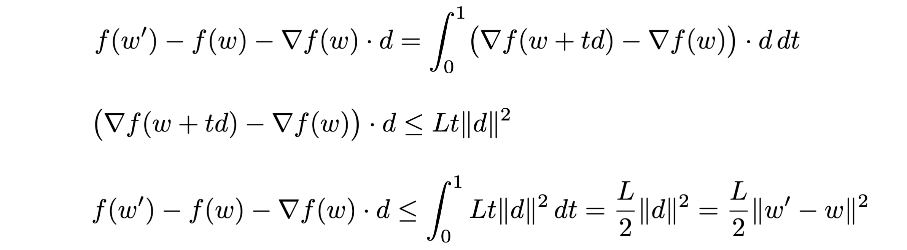

Proof done.

## Convergence

> Why we care about convexity? Because a random function may stuck in a local minimum (when we do gradient descent). But for convex function, local minimum must also be a global minimum.

If we combine L-smooth and convex, then we know how fast it converge (will prove it later):

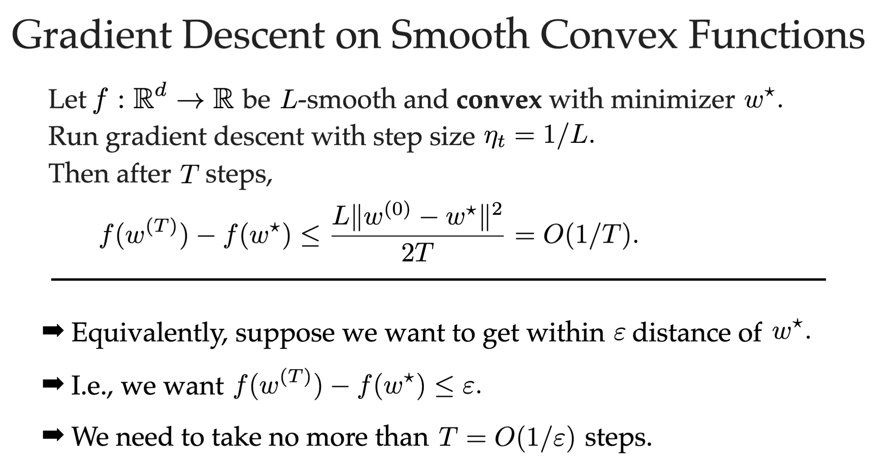

> [!Note]
> Notice it shows how many steps are needed to converge in the worst case. And it depends on your initial guess: $||w^0 - w^*||^2$

### Prove convergence

#### Step 1

Step 1: combining convexity and [smooth descent](#smooth-descent), we get formula 1:\
$f(w^{(t+1)}) - f(w^*) \leq \nabla f(w^{(t)}) \cdot (w^{(t)} - w^*) - \frac{\eta}{2}||\nabla f(w^{(t)})||$

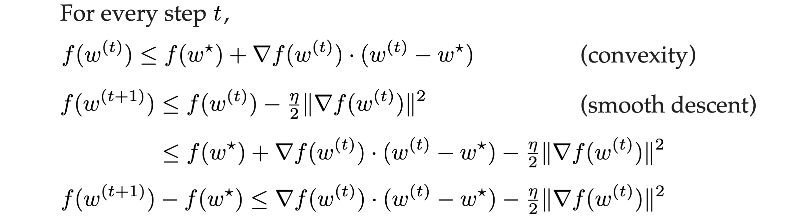

#### Step 2

Step 2: using the definition of gradient descent updates, we get formula 2:\
$||w^{(t)} - w^*||^2 - ||w^{(t+1)} - w^*||^2 = 2 \eta \nabla f(w^{(t)}) \cdot (w^{(t)} - w^*) - \eta^2||\nabla f(w^{(t)})||^2$

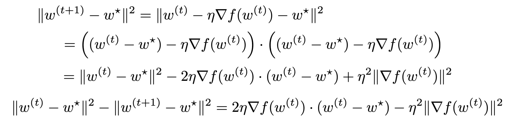

#### Step 3

Combining the formula 1 and 2, we get formula 3:

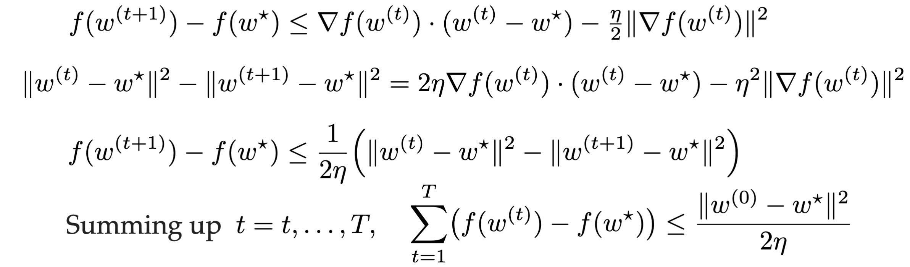
> [!Note]
> In the last line dropped a term $\frac{||w^{(t)} - w^*||}{2\eta}$, because dropping it doesn't influence $\leq$.

#### Step 4

Lastly, combining formula 3 and [smooth descent](#smooth-descent): we get the conclusion:

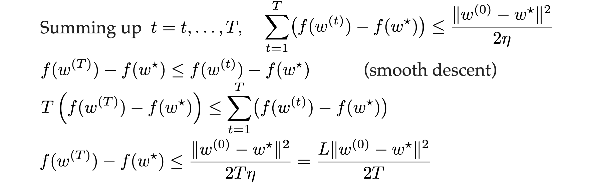

### Conclusion

It tells us that if we have a **L-smooth** **convex** function, after T steps, $f(w^{(T)})$ can converge to $f(w^*) + O(1/T)$. (It cannot be less than $f(w^*)$, because, by definition, $w^*$ is a minima).

## Nesterov Momentum

Can we make it faster? -> Yes, with **Nesterov Momentum**:
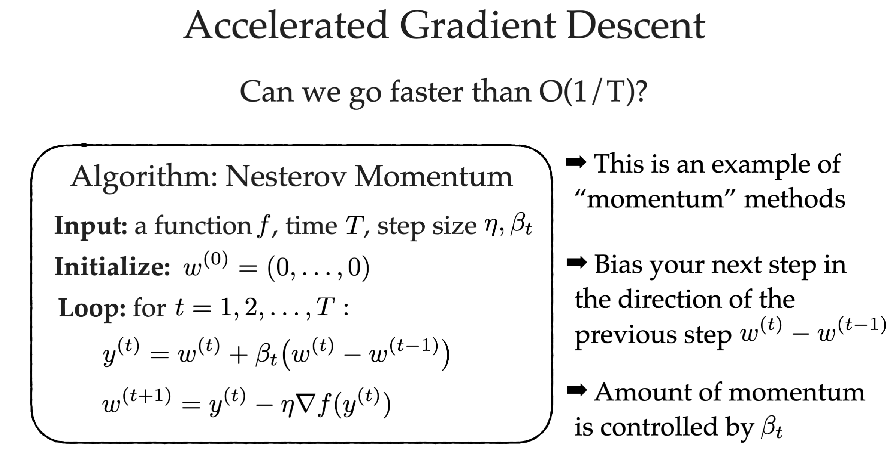

The $y^t$ line contains the information about the gradient descent of last time, which is called momentum. (you can regard $y^{(t)}$ as $w^{(t+0.5)}$)

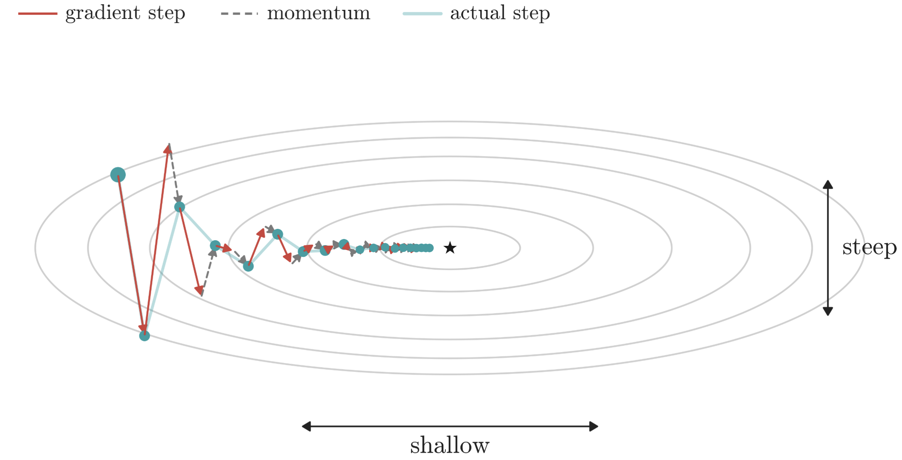

**Gradient descent: O(1/T)**\
**Nesterov Momentum: O(1/T^2)**\
This is a huge improvement!

## AdaGrad + momentum = Adam

By combining AdaGrad and momentum algorithm, we can get **Adam algorithm**!
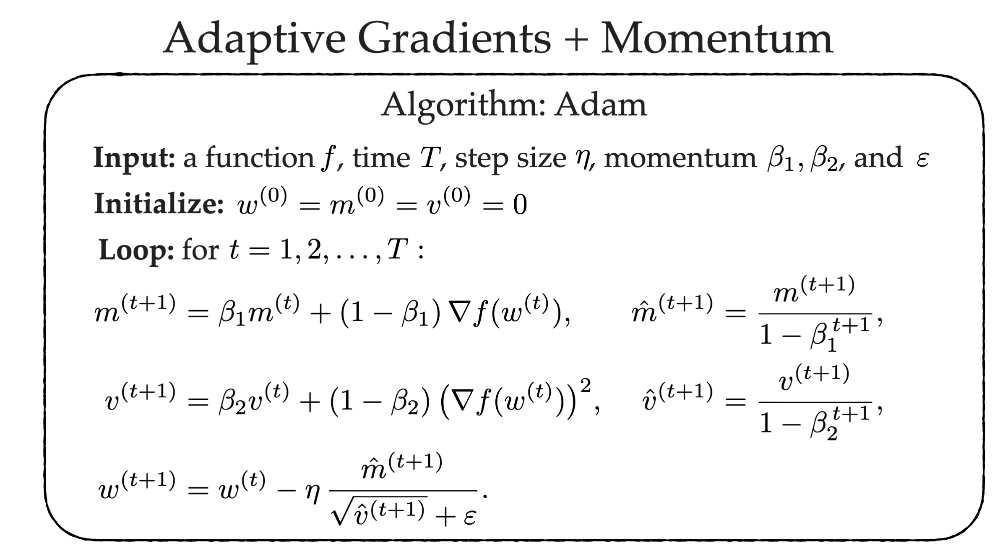

> I guess Adam means ADAptive Momentum.
